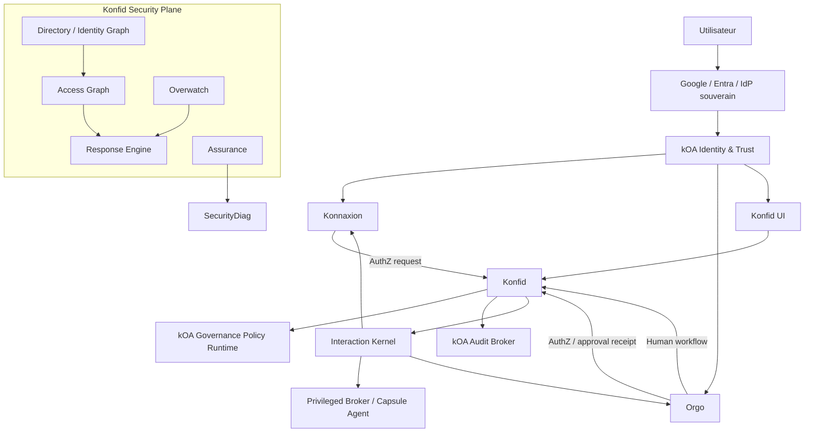
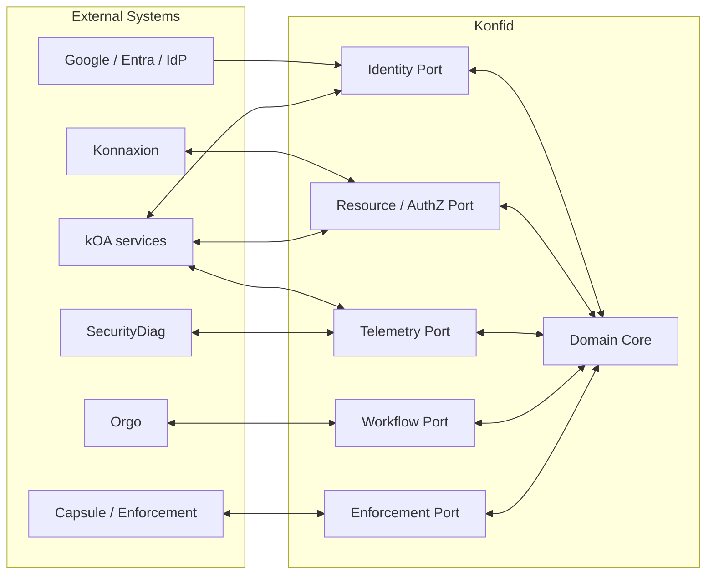
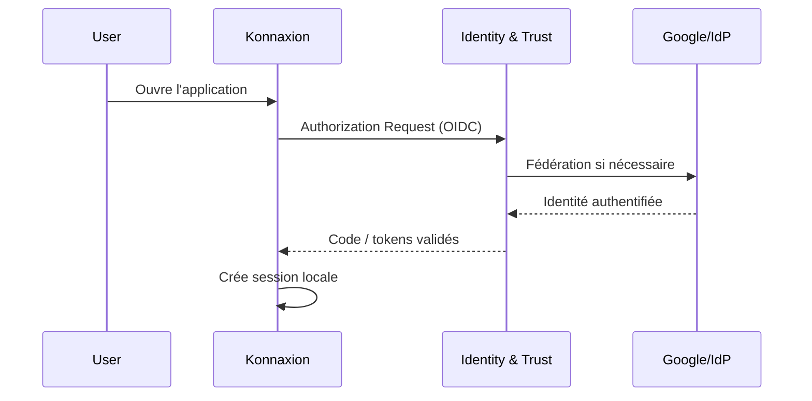
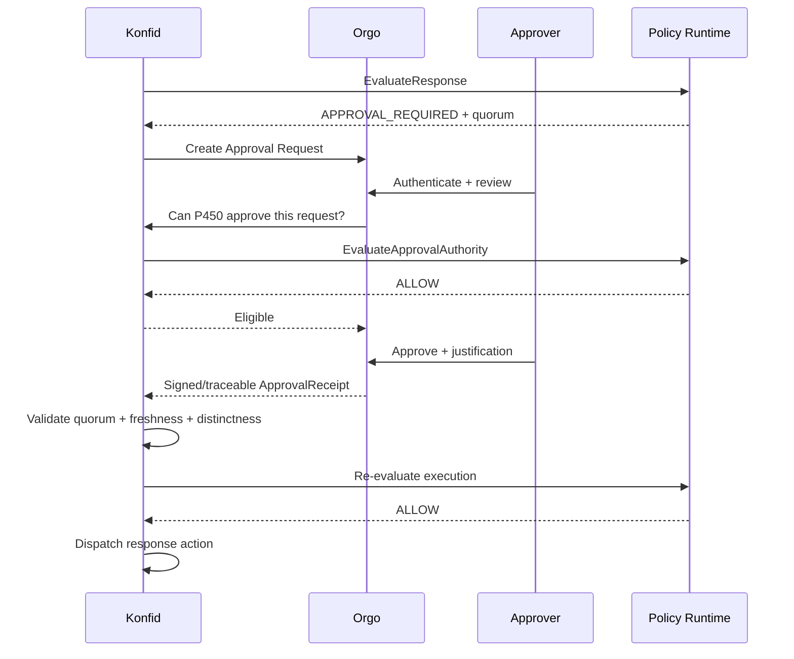

# KONFID — Spécification complète

> Version consolidée de la documentation normative du dépôt. Les fichiers individuels dans `docs/` restent les sources structurées à maintenir.


---

<!-- Source: README.md -->

# Konfid

**Konfid est le plan de sécurité transversal de l'écosystème kOA/Konnaxion/Orgo.**

Il relie une identité humaine ou machine stable à ses comptes, rôles, délégations et périmètres de données; évalue les autorisations contextuelles; observe les signaux de risque; coordonne les mesures de containment; et produit une preuve auditable de chaque décision sensible.

Konfid **n'est pas** un fournisseur de mots de passe, un remplacement d'Orgo, un data lake universel, ni un super-administrateur disposant d'un accès implicite à toutes les données.

## Statut de cette documentation

Cette documentation décrit **l'architecture cible achevée et optimisée** de Konfid. Les mots **DOIT**, **NE DOIT PAS**, **DEVRAIT** et **PEUT** sont normatifs.

- **DOIT / NE DOIT PAS** : invariant de sécurité ou exigence d'architecture.
- **DEVRAIT** : comportement recommandé, sauf justification explicitement documentée.
- **PEUT** : option compatible avec l'architecture.

## Mission

Konfid répond à quatre questions :

1. **Qui agit réellement ?** — principal stable, identité fédérée, compte applicatif, service ou délégation.
2. **Que peut-il faire ici et maintenant ?** — action, ressource, scope, contexte, niveau d'assurance et état de risque.
3. **Que se passe-t-il si le comportement devient dangereux ?** — observation, step-up, restriction, suspension, isolation ou réponse d'urgence.
4. **Peut-on prouver ensuite pourquoi la décision a été prise ?** — policy version, detector version, acteur, approbateurs, justification et receipts.

## Architecture en une page



## Séparation des responsabilités

| Domaine | Autorité / responsabilité |
|---|---|
| Authentification humaine | IdP externe + kOA Identity & Trust |
| Session applicative | Konnaxion, Orgo, Konfid UI, chacun localement |
| Principal stable et bindings | Konfid Directory + Identity & Trust |
| Autorisation transversale | Konfid Access + kOA Governance Policy Runtime |
| Autorisation métier locale | Système propriétaire de la ressource |
| Détection de risque | Konfid Overwatch |
| Décision de containment | Konfid Response + Governance Policy Runtime |
| Workflow humain / escalade | Orgo |
| Exécution privilégiée locale | Privileged Broker / Capsule Agent / adaptateur local |
| Preuve de sécurité | kOA Audit Broker |
| Qualification indépendante | SecurityDiag |
| Transport inter-systèmes | Interaction Kernel |

## Principes non négociables

1. **Aucun mot de passe utilisateur n'est stocké par Konfid.**
2. **Un email n'est jamais une identité canonique.** Les fédérations utilisent `issuer + subject`.
3. **Aucun détecteur d'anomalie ne peut exécuter directement un shutdown.**
4. **Aucun composant unique ne doit pouvoir identifier, autoriser, approuver, exécuter et effacer la preuve.**
5. **Les permissions sont bornées par action, ressource, scope, contexte et durée.**
6. **Les opérations critiques utilisent séparation des rôles, approbateurs distincts et réauthentification récente.**
7. **L'application propriétaire conserve le droit d'être plus restrictive que Konfid.**
8. **Les commandes privilégiées sont allowlistées, typées, idempotentes et accompagnées de receipts.**
9. **Les données de contenu ne sont pas journalisées par défaut.** L'audit vise l'accountability, pas la surveillance indiscriminée.
10. **Toute modification de politique ou de détecteur est versionnée, testée, qualifiée et déployée progressivement.**

## Plans logiques

Konfid est organisé en trois plans distincts :

- **Control Plane** : identité institutionnelle, bindings, grants, délégations, ressources, politiques, configuration.
- **Decision Plane** : décisions d'accès, évaluation de risque, décision de réponse.
- **Evidence Plane** : receipts, événements de sécurité, traces corrélées, preuves forensiques bornées.

La télémétrie volumineuse d'Overwatch **NE DOIT PAS** saturer le chemin critique d'autorisation.

## Documents

- [Définition du produit](docs/00-product-definition.md)
- [Architecture](docs/01-architecture.md)
- [Identité, authentification et SSO](docs/02-identity-authentication.md)
- [Autorisation et scopes](docs/03-authorization.md)
- [Overwatch et risque](docs/04-overwatch.md)
- [Response Engine et containment](docs/05-response-engine.md)
- [Approbations et break-glass](docs/06-approvals-break-glass.md)
- [Audit, preuve et confidentialité](docs/07-audit-evidence.md)
- [Intégrations](docs/08-integrations.md)
- [Contrats, commandes et événements](docs/09-contracts-events.md)
- [Modèle de données canonique](docs/10-data-model.md)
- [Threat model](docs/11-threat-model.md)
- [Déploiement et opérations](docs/12-operations-deployment.md)
- [Tests et assurance](docs/13-testing-assurance.md)
- [Vie privée et gouvernance des données](docs/14-privacy-governance.md)
- [UX d'administration](docs/15-admin-ux.md)
- [Plan d'implémentation](docs/16-implementation-blueprint.md)
- [Invariants finaux](docs/17-final-invariants.md)
- [Glossaire](docs/reference/glossary.md)

## Déploiement de référence

La version cible est conçue comme un **modular monolith strict** pour le cœur transactionnel, avec isolation logique forte et capacité d'extraire certains modules en services indépendants lorsque la sécurité, la charge ou la disponibilité le justifient.

Les candidats naturels à une isolation physique sont :

- ingestion/télémétrie Overwatch;
- evidence/forensics;
- workers de réponse;
- adaptateurs d'enforcement;
- interfaces d'administration.

Le moteur d'autorisation ne dépend jamais d'un pipeline analytique lourd pour répondre.

## Licence et sécurité

Les politiques de divulgation de vulnérabilités et les règles de contribution de sécurité sont décrites dans [SECURITY.md](SECURITY.md).


---

<!-- Source: SECURITY.md -->

# Security Policy

## Objectif

Konfid est un composant de sécurité critique. Une contribution fonctionnelle n'est acceptable que si elle respecte les invariants de confiance, d'autorisation, d'audit et de séparation des pouvoirs définis dans `docs/17-final-invariants.md`.

## Vulnérabilités

Les vulnérabilités de sécurité ne doivent pas être divulguées publiquement avant coordination avec les mainteneurs autorisés. Le canal de signalement doit être configuré par l'organisation qui exploite le dépôt.

Un rapport utile contient idéalement :

- composant et version affectés;
- scénario d'attaque;
- préconditions;
- impact;
- reproduction minimale;
- suggestion de mitigation si connue.

## Changements à haut risque

Les changements suivants exigent une revue sécurité explicite :

- authentication / federation / session validation;
- policy evaluation;
- grant, delegation, role ou scope semantics;
- privileged operations;
- response actions;
- approval quorum;
- audit/evidence retention;
- cryptography, keys, signing or verification;
- detector-to-response mapping;
- tenant isolation;
- service identities;
- break-glass behavior.

## Règles de base

Konfid NE DOIT PAS :

- stocker les mots de passe des utilisateurs;
- lier silencieusement deux identités parce qu'elles partagent un email;
- accepter un `organization_id`, `role`, `scope` ou `actor` fourni par le client comme preuve d'autorité;
- exposer un shell générique via un agent privilégié;
- autoriser un détecteur à modifier automatiquement une policy;
- autoriser l'auteur d'une demande critique à satisfaire seul son propre quorum;
- permettre à un acteur de supprimer ou réécrire les preuves de sa propre action critique;
- utiliser `permissions=["*"]` ou un équivalent non borné dans les chemins de sécurité de production.

## Cryptographie

Les algorithmes, tailles de clé, mécanismes de rotation et fournisseurs cryptographiques doivent être configurables et versionnés. Les secrets ne sont jamais stockés en clair dans le dépôt. Les clés de signature de production doivent être protégées par un KMS/HSM ou un mécanisme équivalent approprié au niveau de risque.

## Principe de défaillance

- Les opérations critiques échouent **fermées** si l'autorité ou la preuve requise est indisponible.
- Les opérations ordinaires peuvent utiliser des capacités déjà émises et non expirées lorsque la politique l'autorise explicitement.
- Une dépendance analytique non critique ne doit pas bloquer la révocation, le deny ou l'isolation.


---

<!-- Source: docs/00-product-definition.md -->

# 00 — Définition du produit

## 1. Définition

Konfid est un **Security Control Plane** transverse. Il unifie l'identité institutionnelle, les autorisations bornées, la connaissance de risque et la coordination des réponses de sécurité entre plusieurs applications sans absorber l'autorité métier de ces applications.

Konfid vise un environnement où une même personne peut posséder :

- plusieurs identités fédérées;
- plusieurs comptes applicatifs;
- plusieurs rôles simultanés;
- des adresses personnelles et des adresses de fonction;
- des délégations temporaires;
- des droits variant par organisation, projet, unité, environnement ou finalité.

## 2. Problèmes résolus

### 2.1 Correspondance personne ↔ comptes ↔ rôles

Konfid maintient un graphe explicite entre :

- `Principal` — personne ou workload stable;
- `IdentityBinding` — identité authentifiée auprès d'un fournisseur;
- `AccountBinding` — compte dans Konnaxion, Orgo ou autre système;
- `RoleAssignment` — fonction organisationnelle;
- `RoleMailboxAssignment` — contrôle d'une adresse de rôle;
- `Delegation` — transfert d'autorité borné et temporaire.

L'email n'est jamais la clé canonique d'identité.

### 2.2 Permission fine des données et actions

Konfid modélise l'autorité comme une relation entre :

`subject + action + resource + scope + context + policy`.

Le système supporte notamment :

- RBAC pour la lisibilité organisationnelle;
- ABAC/context rules pour le contexte;
- capabilities temporaires pour certaines opérations;
- délégations explicites;
- obligations de décision : masquage, no-export, journalisation, step-up, limites quantitatives.

### 2.3 Overwatch

Overwatch collecte des événements de sécurité normalisés, calcule des signaux de risque et détecte des comportements inhabituels sans devenir l'autorité d'autorisation.

### 2.4 Réponse graduée

Konfid coordonne des mesures de contention proportionnées :

`OBSERVE → STEP_UP_AUTH → RATE_LIMIT → REVOKE_SESSION → SUSPEND_GRANT → SUSPEND_ACCOUNT → ISOLATE_SERVICE → FREEZE_DOMAIN → FREEZE_TENANT → EMERGENCY_SHUTDOWN`.

### 2.5 Intervention humaine gouvernée

Les opérations nécessitant une intervention humaine sont orchestrées dans Orgo, avec politique de quorum, séparation des rôles, justification, durée, réauthentification et receipt vérifiable.

### 2.6 Réduction sûre des faux positifs

Les faux positifs alimentent un processus d'amélioration des détecteurs, jamais un affaiblissement automatique des règles de sécurité.

## 3. Non-objectifs

Konfid n'est pas :

- un gestionnaire universel de mots de passe;
- un SIEM généraliste destiné à stocker toute la télémétrie brute de l'entreprise;
- un ERP de rôles RH;
- un outil de surveillance du contenu des utilisateurs;
- un orchestrateur métier général;
- un remplacement du système d'autorisation métier interne de chaque application;
- un moyen de contourner la souveraineté des systèmes propriétaires.

## 4. Personas

### Utilisateur

S'authentifie via Google, Entra, un IdP souverain ou un autre fournisseur approuvé. N'a pas besoin de connaître Konfid pour la majorité des opérations.

### Administrateur de sécurité

Gère les politiques, scopes, délégations sensibles, mappings institutionnels, incidents et réponses.

### Propriétaire de ressource

Définit les classes de ressources, actions et contraintes locales d'une application protégée.

### Approbateur

Autorise certaines actions exceptionnelles selon une policy d'approbation. Son rôle est borné; il n'est pas nécessairement administrateur global.

### Opérateur

Exécute une action privilégiée si le système ne peut pas l'automatiser. L'opérateur peut être distinct du demandeur et de l'approbateur.

### Auditeur

Accède à des preuves minimisées et immuables selon un scope explicitement autorisé.

## 5. Propriétés de succès

Une version achevée de Konfid doit permettre :

- SSO sans duplication de mots de passe;
- révocation transversale rapide;
- autorisation contextuelle inter-applications;
- preuve complète d'une décision sensible;
- confinement sans shutdown global inutile;
- fonctionnement de sécurité en mode dégradé;
- absence de dépendance à un fournisseur d'identité unique;
- limitation stricte du blast radius d'un composant compromis;
- apprentissage des anomalies sans auto-modification non gouvernée;
- intégration d'une nouvelle application via contrats stables, sans modifier le cœur.


---

<!-- Source: docs/01-architecture.md -->

# 01 — Architecture

## 1. Vue d'ensemble

Konfid est conçu selon une architecture hexagonale : le domaine de sécurité ne dépend pas directement de Google, Orgo, Konnaxion, d'une base de données spécifique ou d'un transport particulier. Ces dépendances sont intégrées via des ports et adapters.



## 2. Les trois plans

### 2.1 Control Plane

État versionné de sécurité :

- principals et bindings;
- comptes et organisations;
- ressources et actions;
- rôles, grants, délégations;
- politiques et policy bundles;
- approbation policies;
- detector catalog et response mappings;
- configuration des intégrations.

### 2.2 Decision Plane

Chemin critique et faible latence :

- `EvaluateAccess`;
- `EvaluateRisk`;
- `EvaluateResponse`;
- `ValidateApproval`;
- `IssueCapability`;
- `RevokeCapability`.

Le Decision Plane DOIT pouvoir répondre sans attendre les pipelines analytiques lents.

### 2.3 Evidence Plane

Contient :

- audit receipts;
- security events;
- traces corrélées;
- décision/policy references;
- forensic evidence bornée;
- preuves de qualification de détecteur/policy.

La télémétrie brute volumineuse peut être stockée dans un système distinct du registre de preuve faisant autorité.

## 3. Modules du cœur

### Directory

Maintient les principals, bindings, comptes, aliases vérifiés, role mailboxes et relations d'organisation.

### Access

Maintient les grants, délégations, scopes, resource catalog, capabilities et obligations.

### Policy Adapter

Transforme le contexte canonique Konfid en requêtes vers kOA Governance Policy Runtime et vérifie la décision retournée.

### Overwatch

Normalise la télémétrie, construit des baselines, exécute des détecteurs, produit des `RiskSignal` versionnés.

### Response

Transforme un état de risque et le contexte en `ResponseProposal`, obtient les autorisations nécessaires et coordonne l'exécution.

### Approval

Gère la policy d'approbation, la validation de quorum, la séparation des acteurs et la validité temporelle des receipts provenant d'Orgo.

### Assurance

Qualifie les changements de policy et détecteurs, orchestre replay, shadow, canary et intégration SecurityDiag.

### Evidence

Produit les événements minimisés vers Audit Broker et gère les références vers les preuves restreintes.

## 4. Modular monolith, pas microservices par défaut

La version de référence utilise un modular monolith pour :

- réduire la complexité transactionnelle;
- simplifier les invariants;
- diminuer les surfaces réseau;
- rendre les décisions synchrones plus simples à raisonner;
- accélérer les migrations cohérentes.

Chaque module DOIT cependant :

- avoir une API interne explicite;
- ne pas lire directement les tables privées d'un autre module;
- publier des domain events versionnés;
- posséder ses migrations ou namespaces clairement identifiés;
- pouvoir être extrait sans changer le modèle canonique.

## 5. Bulkheads

Les ressources opérationnelles doivent être isolées :

- pool de workers Authorization;
- pool Response/Revocation prioritaire;
- pool ingestion Overwatch;
- pool analytics/baseline;
- pool evidence export;
- pool admin/reporting.

Un flood télémétrique ne doit jamais épuiser les ressources réservées à `DENY`, `REVOKE` ou `ISOLATE`.

## 6. Priorités de traitement

1. **P0 — sécurité immédiate** : revoke, deny propagation, isolate, credential invalidation.
2. **P1 — décisions d'autorisation**.
3. **P2 — security event ingestion**.
4. **P3 — analytics, baselines, reporting et replays**.

## 7. Défaillance et continuité

### Dépendance IdP indisponible

- Les sessions existantes peuvent continuer dans leurs limites locales.
- Les opérations exigeant une réauthentification ou un niveau d'assurance supérieur sont bloquées.
- Les comptes break-glass souverains restent disponibles selon leur policy.

### Orgo indisponible

- Les actions automatiques déjà permises peuvent continuer.
- Toute action nécessitant un quorum humain reste `BLOCKED_PENDING_APPROVAL`.
- Revoke/deny/isolate ne dépendent pas d'Orgo si leur policy autorise l'automatisation.

### Overwatch indisponible

- L'autorisation de base continue.
- Les signaux de risque frais deviennent `UNKNOWN`.
- Les politiques critiques peuvent choisir de bloquer certaines actions si `risk_freshness` est obligatoire.

### Audit Broker indisponible

- Les actions ordinaires peuvent être mises en file locale durable si la policy l'autorise.
- Une opération critique exigeant un receipt auditable DOIT échouer fermée.

### Governance Policy Runtime indisponible

- Les opérations critiques échouent fermées.
- Les capacités déjà signées et non expirées peuvent rester utilisables uniquement si elles ont été conçues explicitement pour une continuité bornée.

## 8. Propriété des données

Konfid ne devient jamais la base canonique des objets métier. Il stocke des **références de ressource** et leur classification de sécurité, pas la donnée métier elle-même.

Exemple :

```text
resource_ref = konnaxion://org/ABC/employee/5821
resource_class = HR.EMPLOYEE.RESTRICTED
data_owner = konnaxion
```

## 9. Trust boundaries

Les frontières principales sont :

- navigateur ↔ application;
- application ↔ Konfid;
- Konfid ↔ kOA policy/audit;
- Konfid ↔ Orgo;
- Konfid ↔ enforcement agent;
- tenant A ↔ tenant B;
- control plane ↔ evidence plane;
- operator humain ↔ privileged execution.

Chaque passage de frontière exige une identité authentifiée, un contrat versionné, un scope explicite et une corrélation traçable.


---

<!-- Source: docs/02-identity-authentication.md -->

# 02 — Identité, authentification et SSO

## 1. Principe

Konfid ne réimplémente pas l'authentification humaine. Il consomme une preuve d'identité émise ou validée par **kOA Identity & Trust**, qui peut fédérer Google, Microsoft Entra ID, un fournisseur souverain ou un autre IdP approuvé.

## 2. Modèle d'identité

```text
Principal
 ├── IdentityBinding[]
 ├── AccountBinding[]
 ├── ContactEndpoint[]
 ├── RoleAssignment[]
 ├── RoleMailboxAssignment[]
 └── Delegation[]
```

### Principal

Identité canonique Konfid : personne, workload ou agent autorisé.

### IdentityBinding

Lien entre un principal et une identité authentifiée externe.

Clé de fédération recommandée :

```text
provider_type + issuer + subject
```

Pour OIDC, `issuer + sub` est l'identifiant externe canonique.

### AccountBinding

Lien entre le principal et le compte local d'une application :

```text
system = konnaxion
account_id = K-882
principal_id = P123
```

### ContactEndpoint

Email, téléphone ou endpoint de notification vérifié. Un contact n'est pas une identité canonique.

### RoleMailboxAssignment

Représente qui contrôle une adresse fonctionnelle et pendant quelle période :

```text
mailbox = direction@abc.ca
principal = P123
role = DIRECTOR
valid_from = ...
valid_until = ...
```

## 3. Interdiction du linking silencieux par email

Konfid NE DOIT PAS fusionner deux principals parce que :

- leurs emails sont identiques;
- leur nom d'affichage est identique;
- leur domaine email est identique;
- un email ancien est réattribué.

Tout linking à haut impact doit être :

- fondé sur une identité authentifiée stable;
- explicitement approuvé ou attesté selon policy;
- audité;
- réversible par procédure gouvernée.

## 4. Flux SSO Konnaxion



Konnaxion conserve sa session applicative. Il ne transmet pas son cookie à Orgo ou Konfid.

## 5. Flux SSO Orgo

Orgo répète son propre flux OIDC. Si l'IdP possède déjà une session, l'expérience peut sembler « un clic » sans partage de cookie inter-application.

## 6. Flux Konfid UI

Le dashboard Konfid utilise la même autorité d'identité mais crée une session Konfid distincte. La possession d'une session Konfid ne confère aucune permission implicite.

## 7. Service-to-service authentication

Une requête interservice contient au minimum deux identités conceptuellement distinctes :

```text
caller_service = svc:konnaxion-prod
actor_principal = P123
```

- `caller_service` prouve quel workload appelle Konfid.
- `actor_principal` indique au nom de qui l'action est demandée.

L'identité du service DOIT être authentifiée par une workload identity, certificat, signature ou credential court terme. Un token Google utilisateur NE DOIT PAS servir de credential interservice générique.

## 8. Session vs autorité

Une session locale prouve seulement qu'un utilisateur est authentifié auprès de l'application. Pour toute action sensible, l'application doit obtenir ou vérifier une décision d'autorisation fraîche.

```text
Session valide != droit permanent
```

## 9. Step-up authentication

Une policy peut exiger :

- authentification plus récente;
- méthode résistante au phishing;
- second facteur;
- device trust;
- présence d'un humain;
- combinaison de plusieurs facteurs.

Une réponse typique :

```json
{
  "decision": "STEP_UP_REQUIRED",
  "required_assurance": "phishing_resistant",
  "max_auth_age_seconds": 300
}
```

Après step-up, l'application soumet une nouvelle évaluation.

## 10. Multi-IdP

Google peut être le fournisseur privilégié pour l'UX, mais Konfid DOIT rester multi-IdP. Au minimum, l'architecture doit pouvoir intégrer :

- Google;
- Microsoft Entra ID;
- IdP souverain/local;
- identité d'urgence hors fournisseur externe.

## 11. Break-glass identity

Les identités d'urgence :

- ne dépendent pas d'un IdP SaaS unique;
- utilisent des credentials matériels ou équivalents fortement protégés;
- sont très peu nombreuses;
- sont désactivées ou scellées hors usage normal lorsque possible;
- déclenchent un audit renforcé;
- ne contournent pas automatiquement les règles de quorum;
- possèdent une portée et une durée limitées.

## 12. Révocation

Konfid peut révoquer :

- une IdentityBinding;
- une capability;
- une délégation;
- un grant;
- un compte applicatif via adaptateur;
- une session via notification à l'application propriétaire.

La révocation de session inter-applications est une commande explicite et auditable; elle n'implique pas nécessairement suppression du compte.


---

<!-- Source: docs/03-authorization.md -->

# 03 — Autorisation, scopes et délégations

## 1. Objectif

Konfid fournit une autorisation transversale fine sans remplacer les règles métier locales. Toute décision est fondée sur un contexte explicite et borné.

## 2. Modèle canonique

Une décision d'accès prend la forme :

```text
subject + action + resource + scope + context + policy_state -> decision + obligations
```

### Subject

Peut être :

- `Principal` humain;
- `WorkloadPrincipal`;
- groupe ou rôle résolu en contexte;
- délégation active;
- capability explicitement émise.

### Action

Les actions sont normalisées et versionnées, par exemple :

- `employee.read`;
- `employee.export`;
- `case.approve`;
- `security.policy.modify`;
- `security.account.suspend`;
- `security.tenant.freeze`.

### Resource

Une ressource est identifiée par :

- système propriétaire;
- classe de ressource;
- identifiant ou selector borné;
- classification;
- tenant/organisation.

### Scope

Le scope borne l'autorité. Exemples :

- organisation;
- world;
- département;
- projet;
- site;
- dossier;
- environnement;
- plage temporelle;
- finalité déclarée.

### Context

Peut inclure :

- assurance d'authentification;
- âge de l'auth;
- device trust;
- risk state;
- heure;
- réseau;
- justification;
- délégation;
- quantité demandée;
- sensibilité de la ressource;
- état de l'incident.

## 3. Décisions

Konfid expose au minimum :

- `ALLOW`;
- `DENY`;
- `BLOCKED`;
- `STEP_UP_REQUIRED`;
- `APPROVAL_REQUIRED`.

`BLOCKED` signifie qu'une précondition de sécurité manque ou est indéterminée; ce n'est pas équivalent à un deny métier permanent.

## 4. Obligations

Une décision `ALLOW` peut inclure des obligations exécutoires :

```json
{
  "decision": "ALLOW",
  "obligations": [
    {"type": "audit", "level": "security"},
    {"type": "max_rows", "value": 100},
    {"type": "mask_fields", "fields": ["medical_detail"]},
    {"type": "no_export"},
    {"type": "expires_in", "seconds": 900}
  ]
}
```

Une application qui ne sait pas appliquer une obligation obligatoire DOIT traiter la décision comme `BLOCKED`.

## 5. RBAC + ABAC + capabilities

Konfid utilise un modèle hybride :

### RBAC

Pour exprimer la structure compréhensible : rôle de directeur, analyste RH, responsable sécurité.

### ABAC / context policy

Pour exprimer les contraintes : organisation, classification, finalité, risque, assurance, heure, quantité.

### Capabilities

Pour déléguer ponctuellement une autorité très précise, courte et vérifiable sans créer un rôle global.

## 6. Grants

Un grant minimal contient :

```text
subject
role_or_capability
actions[]
resource_classes[]
scope
constraints
valid_from
valid_until
issued_by
policy_version
status
```

Les grants DOIVENT avoir un scope explicite. Un grant global est réservé aux cas où le domaine fonctionnel est réellement global et doit être justifié.

## 7. Délégations

Une délégation contient :

```text
from_principal
to_principal
actions
scope
resource_constraints
valid_from
valid_until
max_chain_depth
reason
issued_by
revocable
```

Les actions réalisées sous délégation sont attribuées à l'acteur réel :

```text
actor = P782
authority_source = delegation:D-91
delegator = P123
```

Konfid NE DOIT PAS journaliser l'action comme si le délégant l'avait lui-même effectuée.

## 8. Chaînes de délégation

La profondeur maximale est bornée. Les politiques critiques peuvent interdire toute re-délégation.

Exemple :

```text
P123 -> P782 -> P991
```

n'est valide que si :

- le grant d'origine autorise la redélégation;
- chaque délégation réduit ou conserve le scope, jamais ne l'élargit;
- toutes sont actives et non révoquées;
- la profondeur maximale n'est pas dépassée.

## 9. Ressources appartenant aux applications

Konfid ne lit pas directement les données métier pour prendre une décision sauf nécessité explicitement conçue. Les applications fournissent des attributs minimaux ou des références vérifiables.

Le propriétaire de la ressource applique ensuite :

```text
final_decision = konfid_allows AND local_policy_allows
```

L'application peut être plus restrictive; elle ne peut pas transformer un `DENY` Konfid en `ALLOW` pour une opération soumise à Konfid.

## 10. Data scopes

Les classes de données doivent être explicites :

```text
HR.EMPLOYEE.BASIC
HR.EMPLOYEE.COMPENSATION
HR.EMPLOYEE.MEDICAL
FINANCE.INVOICE
FINANCE.PAYROLL
SECURITY.AUDIT.RESTRICTED
```

Les permissions ne doivent pas reposer seulement sur des modules UI ou des routes HTTP.

## 11. Quantité et agrégation

Une permission de lire un objet ne signifie pas nécessairement permission de lire 100 000 objets.

Les policies peuvent limiter :

- nombre d'objets;
- débit;
- export;
- agrégation;
- période;
- combinaison de champs.

## 12. Policy evaluation

Konfid construit un `AuthorizationContext` canonique puis appelle Governance Policy Runtime.

La policy response DOIT inclure :

- décision;
- policy id/version;
- raisons structurées;
- obligations;
- expiration/freshness;
- exigences d'approbation ou step-up;
- decision id corrélable.

## 13. Cache

Les décisions peuvent être cachées uniquement si :

- TTL court et explicite;
- scope exact;
- politique cacheable;
- invalidation possible par révocation;
- action non critique ou capability signée bornée.

Les opérations critiques de sécurité ne doivent pas dépendre d'un cache long.


---

<!-- Source: docs/04-overwatch.md -->

# 04 — Overwatch et moteur de risque

## 1. Mission

Overwatch observe les événements de sécurité, construit des signaux de risque et détecte les comportements inhabituels. Il **n'autorise pas** une action et **n'exécute pas** de réponse privilégiée.

Sa sortie est un `RiskSignal`, jamais un ordre direct de shutdown.

## 2. Pipeline


## 3. Sources

Sources possibles :

- décisions d'accès;
- authentifications importantes;
- changements de permission;
- accès à des données sensibles;
- exports;
- actions privilégiées;
- erreurs répétées;
- revocations;
- événements endpoint/service;
- signaux Capsule/host;
- événements applicatifs explicitement déclarés.

Konfid ne doit pas collecter « tout » par défaut.

## 4. Profils d'observabilité

### ESSENTIAL

Toujours actif pour les événements de sécurité minimaux :

- acteur;
- service;
- action;
- classe de ressource;
- résultat;
- policy/decision ref;
- timestamp;
- corrélation;
- version logicielle.

### SECURITY

Ajoute les métadonnées utiles à la détection : fréquence, volume, patterns, erreurs, caractéristiques agrégées.

### FORENSIC

Capture temporairement enrichie, uniquement avec :

- scope précis;
- motif;
- autorité valide;
- durée/expiration;
- classification;
- accès restreint;
- audit renforcé.

## 5. Minimisation

Overwatch privilégie les **métadonnées de sécurité** plutôt que le contenu. Par exemple :

```json
{
  "actor": "P123",
  "operation": "employee.read",
  "resource_class": "HR.EMPLOYEE.MEDICAL",
  "count": 420,
  "window_seconds": 120,
  "decision": "ALLOW"
}
```

plutôt que le contenu des 420 dossiers.

## 6. Détecteurs

Types de détecteurs possibles :

- règles déterministes;
- seuils adaptatifs;
- modèles comportementaux;
- corrélation multi-sources;
- détection de séquence;
- réputation de service/appareil;
- intégrité de configuration.

Chaque détecteur DOIT avoir :

```text
detector_id
version
owner
input_schema
output_schema
training_or_rule_provenance
confidence_semantics
known_limitations
activation_state
rollout_state
```

## 7. RiskSignal

Exemple :

```json
{
  "risk_signal_id": "RS-9921",
  "principal": "P123",
  "target": "tenant:ABC",
  "severity": "critical",
  "score": 92,
  "confidence": 0.96,
  "detector_id": "bulk-sensitive-read",
  "detector_version": "17",
  "reasons": [
    "420 sensitive records in 120 seconds",
    "18x baseline",
    "export attempted after read burst"
  ],
  "observed_at": "...",
  "expires_at": "..."
}
```

Le score n'est jamais à lui seul une autorisation.

## 8. Agrégation de risque

Konfid peut combiner plusieurs signaux, mais la combinaison doit être versionnée et explicable. Les policies doivent pouvoir distinguer :

- risque inconnu;
- risque faible;
- risque élevé;
- preuve déterministe de compromission.

## 9. Anti-poisoning

Les baselines et modèles ne doivent pas être modifiés directement par les données de production sans garde-fous. Les mesures comprennent :

- fenêtres d'apprentissage contrôlées;
- exclusion des incidents connus;
- provenance des features;
- validation hors ligne;
- détection de drift;
- shadow mode;
- rollback immédiat.

## 10. Faux positifs

Cycle normatif :

```text
incident
 -> classification
 -> candidate detector change
 -> historical replay
 -> false-positive / false-negative analysis
 -> shadow mode
 -> SecurityDiag qualification
 -> approval
 -> signed version
 -> canary rollout
 -> production
```

Une classification `FALSE_POSITIVE` NE DOIT PAS désactiver automatiquement une règle ni réduire une permission.

## 11. Déploiement Canary

Les détecteurs supportent :

- disabled;
- shadow;
- 1%;
- 10%;
- 50%;
- 100%;
- rollback.

Pour les détecteurs critiques, la comparaison avec la version précédente doit être observable pendant le rollout.

## 12. Bulkhead et overload

Overwatch doit supporter :

- backpressure;
- admission control;
- sampling non critique;
- file durable;
- DLQ;
- dégradation contrôlée.

Il NE DOIT PAS consommer les ressources réservées au chemin d'autorisation ou aux révocations P0.

## 13. Conservation

La rétention dépend de la classe de donnée et du besoin de sécurité. Les features et agrégats peuvent avoir une rétention différente des preuves d'audit.

Les données forensiques ont une durée bornée et une procédure de purge vérifiable.


---

<!-- Source: docs/05-response-engine.md -->

# 05 — Response Engine et containment

## 1. Mission

Response Engine transforme des faits et signaux de risque en **réponses de sécurité gouvernées**, proportionnées et réversibles lorsque possible.

## 2. Séparation fondamentale

```text
Overwatch -> RiskSignal
Policy Runtime -> autorise/interdit la réponse
Response Engine -> coordonne
Local Enforcement -> exécute
Audit Broker -> conserve la preuve
```

Overwatch NE DOIT PAS appeler directement un agent privilégié.

## 3. Échelle de containment

Ordre recommandé de gravité :

1. `OBSERVE`
2. `STEP_UP_AUTH`
3. `RATE_LIMIT`
4. `REVOKE_SESSION`
5. `SUSPEND_GRANT`
6. `SUSPEND_ACCOUNT`
7. `ISOLATE_SERVICE`
8. `FREEZE_SECURITY_DOMAIN`
9. `FREEZE_TENANT`
10. `EMERGENCY_SHUTDOWN`

Le moteur choisit la **plus petite mesure** capable de contenir raisonnablement le risque selon policy.

## 4. ResponseProposal

```text
proposal_id
risk_signals[]
requested_action
target
scope
duration
rationale
policy_context
requires_approval
created_at
expires_at
```

Une proposition n'est pas une autorisation.

## 5. ResponseDecision

Après évaluation par Governance Policy Runtime :

```text
ALLOW_AUTOMATIC
APPROVAL_REQUIRED
STEP_UP_REQUIRED
DENY
BLOCKED
```

La réponse inclut :

- policy version;
- maximum scope;
- durée maximale;
- quorum éventuel;
- obligations d'audit;
- exigences de notification;
- rollback/closure requirements.

## 6. Exécution privilégiée

Toute action d'enforcement critique doit utiliser une commande typée et allowlistée :

```json
{
  "action_id": "ACT-7819",
  "operation": "SUSPEND_GRANT",
  "target": "grant:G-882",
  "scope": "tenant:ABC",
  "decision_ref": "PD-992",
  "expires_at": "...",
  "idempotency_key": "..."
}
```

L'agent privilégié vérifie :

- caller identity;
- opération autorisée;
- target et scope;
- decision receipt;
- fraîcheur/expiration;
- idempotency;
- version de contrat.

Aucun shell générique ne doit être exposé.

## 7. Idempotence

Chaque action possède un `action_id` stable. Si le réseau coupe après exécution, un retry retourne le receipt original plutôt que de répéter dangereusement l'opération.

Le modèle de livraison est :

**at-least-once + idempotence + receipts + reconciliation**, pas une promesse fragile de « exactly once » distribuée.

## 8. Transactional Outbox

Avant émission vers Interaction Kernel :

```text
transaction DB
  - créer ResponseAction
  - créer OutboxEvent
commit
```

Un worker publie ensuite l'événement. La perte du processus entre commit et publication ne perd donc pas l'intention.

## 9. Réconciliation

Une action sans receipt final passe dans un état explicite :

- `PENDING`;
- `DISPATCHED`;
- `EXECUTED`;
- `FAILED`;
- `UNKNOWN`;
- `RECONCILING`;
- `ROLLED_BACK`;
- `CLOSED`.

`UNKNOWN` ne doit jamais être traduit silencieusement en succès.

## 10. Durée et auto-expiration

Toute restriction temporaire doit avoir un TTL lorsque possible. Une suspension temporaire ne doit pas devenir permanente par oubli.

Les actions permanentes exigent une justification et une procédure de closure explicite.

## 11. Réponse à un export massif

Exemple :

```text
420 dossiers sensibles / 120 s
+ export immédiat
 -> RiskSignal critical
 -> suspend HR_EXPORT
 -> revoke current session
 -> require phishing-resistant reauth
 -> open security case in Orgo
 -> preserve evidence
```

Le tenant entier n'est pas gelé si le risque peut être contenu avec un scope plus petit.

## 12. Emergency shutdown

`EMERGENCY_SHUTDOWN` est la dernière mesure. Elle exige typiquement :

- preuve ou risque critique défini par policy;
- authentification forte récente;
- quorum multi-humain sauf scénario automatisé exceptionnel explicitement pré-approuvé;
- scope exact;
- receipt d'approbation;
- commande signée et expirante;
- plan de restauration;
- audit immédiat;
- revue post-incident.

## 13. Closure

Une réponse n'est pas terminée à l'exécution. Elle doit avoir une phase de fermeture :

- état du risque;
- action de restauration;
- révocation des accès temporaires;
- collecte de receipts;
- justification finale;
- classification true/false positive;
- lessons learned;
- changement de détecteur/policy séparé si nécessaire.


---

<!-- Source: docs/06-approvals-break-glass.md -->

# 06 — Approbations, séparation des pouvoirs et break-glass

## 1. Principe

Orgo orchestre l'expérience humaine, mais **Konfid reste l'autorité qui valide si un ensemble d'approbations satisfait la policy de sécurité**.

Une case Orgo « approved=true » n'est jamais suffisante à elle seule.

## 2. ApprovalPolicy

Une policy peut contenir :

```text
operation
minimum_authority
threshold
eligible_roles[]
distinct_humans
requester_may_approve
operator_may_approve
same_manager_chain_allowed
required_assurance
max_auth_age
approval_ttl
justification_required
scope_constraints
emergency_variant
```

Exemple :

```text
operation = FREEZE_TENANT
threshold = 2-of-3
distinct_humans = true
requester_may_approve = false
operator_may_approve = false
required_assurance = phishing_resistant
max_auth_age = 300s
approval_ttl = 15m
```

## 3. Acteurs distincts

Les rôles conceptuels sont :

- demandeur;
- approbateur;
- opérateur;
- observateur/auditeur;
- autorité de closure.

Selon la criticité, plusieurs rôles peuvent être tenus par la même personne, mais la policy doit le déclarer. Pour les opérations extrêmes, séparation stricte.

## 4. Flux d'approbation



## 5. ApprovalReceipt

Minimum :

```text
approval_id
request_id
approver_principal
decision
justification_ref or bounded text
auth_assurance
auth_time
approved_at
scope
policy_version
orgo_case_ref
signature_or_integrity_ref
```

## 6. Fraîcheur

Les approbations expirent. Konfid réévalue juste avant exécution :

- approbateur toujours actif ?
- rôle encore valide ?
- grant révoqué ?
- auth trop ancienne ?
- scope identique ?
- request modifiée ?
- quorum toujours satisfait ?

Toute modification significative de la demande invalide les approbations précédentes sauf policy contraire explicite.

## 7. Auto-approbation

Par défaut :

```text
requester_may_approve = false
```

Un administrateur global ne bénéficie pas d'une exception implicite.

## 8. Break-glass

Le break-glass est une **procédure gouvernée d'exception**, pas un compte root permanent.

Il doit définir :

- trigger admissible;
- identité d'urgence;
- scope précis;
- actions permises;
- durée;
- compensating controls;
- audit renforcé;
- notification;
- révocation/closure;
- revue obligatoire.

## 9. Modes d'urgence

### Emergency access

Permet un accès temporaire à une ressource ou capability normalement inaccessible.

### Emergency containment

Permet une restriction rapide lorsqu'un délai d'approbation créerait un risque supérieur.

### Emergency recovery

Permet de restaurer un système isolé ou un service de sécurité selon procédures pré-approuvées.

Chaque mode a une policy distincte.

## 10. Indépendance des fournisseurs externes

Au moins un chemin de break-glass critique doit fonctionner sans Google, Entra ou Orgo SaaS. Cela ne signifie pas contourner Konfid; cela signifie posséder des credentials souverains, un stockage de policy local et un chemin d'audit robuste.

## 11. Orgo compromis

Si Orgo est compromis, l'attaquant ne doit pas pouvoir produire seul une action critique. Les mitigations comprennent :

- vérification de l'identité de l'approbateur par Konfid;
- validation indépendante de son autorité;
- policy version immuable;
- request digest;
- quorum;
- réévaluation finale;
- receipts intègres.

## 12. Notifications

Les notifications ne sont pas des autorisations. Email/SMS peut informer un approbateur, mais l'approbation doit être effectuée dans un canal authentifié supportant les exigences d'assurance de la policy.


---

<!-- Source: docs/07-audit-evidence.md -->

# 07 — Audit, preuve et confidentialité

## 1. Principe

Konfid applique **accountability without indiscriminate surveillance** : enregistrer le minimum nécessaire pour expliquer et vérifier les décisions de sécurité, sans transformer Audit Broker en copie généralisée du contenu métier.

## 2. Audit faisant autorité

Les événements critiques sont transmis à kOA Audit Broker, qui fournit :

- intégrité;
- orientation append-only;
- chaîne de garde;
- rétention bornée;
- continuité locale lorsque prévue;
- export indépendant;
- séparation entre preuve publique et preuve restreinte.

## 3. Événement minimal

Un événement de sécurité critique contient au minimum :

```text
event_id
timestamp
actor_principal
caller_service
action
target_ref
resource_class
tenant
policy_ref
decision_ref
outcome
correlation_id
software_version
disclosure_class
```

Selon le cas :

```text
delegation_ref
risk_signal_refs[]
approval_refs[]
response_action_ref
detector_version
justification_ref
```

## 4. Ce qui ne doit pas être enregistré par défaut

- contenu d'emails;
- documents métier complets;
- mots de passe;
- tokens bearer;
- secrets;
- données médicales détaillées;
- payloads complets lorsqu'une référence suffit.

## 5. Claim Check

Les preuves volumineuses ou très sensibles sont stockées hors événement :

```text
SecurityEvent
  evidence_ref = sealed://evidence/9282
  digest = sha256:...
  classification = restricted
```

Le store de preuve applique sa propre autorisation. L'audit conserve une référence et un digest d'intégrité.

## 6. Correlation et causation

Tous les flux significatifs utilisent :

- `correlation_id` — même processus logique;
- `causation_id` — événement/commande qui a causé celui-ci;
- `request_id` — demande locale;
- `decision_id` — décision de policy;
- `action_id` — action de response.

Cela permet de reconstruire :

```text
login -> access request -> risk signal -> policy decision -> approval -> containment -> receipt -> closure
```

## 7. Niveaux de divulgation

Exemple :

- `PUBLIC_SECURITY_METADATA`;
- `INTERNAL`;
- `RESTRICTED`;
- `FORENSIC_RESTRICTED`;
- `SEALED`.

La classification commande qui peut consulter et exporter la preuve.

## 8. Lecture de l'audit

Lire des preuves restreintes est lui-même une action auditable. Les administrateurs de système n'obtiennent pas automatiquement le droit de lire les éléments forensiques.

## 9. Intégrité et horodatage

Les preuves critiques doivent pouvoir démontrer :

- ordre logique;
- digest;
- identité de l'émetteur;
- version du logiciel;
- policy/detector version;
- timestamp fiable ou source de temps;
- absence de modification non détectée.

Le mécanisme précis peut employer signatures, MAC, hash chaining, transparency log ou service d'attestation selon le déploiement.

## 10. Rétention

Chaque classe d'événement possède :

```text
retention_period
legal_or_policy_basis
minimum_required
maximum_allowed
purge_method
archive_policy
```

Une rétention « pour toujours » n'est pas la valeur par défaut.

## 11. Export d'audit

Les exports sont :

- scoped;
- filtrés par classification;
- limités en volume;
- watermarkés/identifiés lorsque pertinent;
- enregistrés comme événement;
- accompagnés d'un manifest et d'un digest si nécessaire.

## 12. Non-répudiation pragmatique

Konfid vise une preuve forte de provenance et d'intégrité. Il ne prétend pas résoudre abstraitement toute non-répudiation juridique. Les garanties exactes dépendent des clés, identités, politiques et infrastructures de l'organisation.

## 13. Audit indisponible

Les opérations à très haut impact dont la policy exige une preuve synchronisée doivent échouer fermées si aucun mécanisme durable d'audit n'est disponible.

Les opérations ordinaires peuvent utiliser un spool local durable signé/chaîné si la policy le permet, suivi d'une réconciliation obligatoire.


---

<!-- Source: docs/08-integrations.md -->

# 08 — Intégrations

## 1. Principe général

Toute intégration est un adapter autour d'un contrat canonique Konfid. Le domaine Konfid ne doit pas importer directement les modèles internes de Konnaxion, Orgo, Google ou d'un autre produit.

## 2. Konnaxion

### Rôle

Konnaxion est :

- relying party pour l'authentification;
- Policy Enforcement Point pour ses données;
- source d'événements de sécurité;
- consommateur de décisions Konfid;
- cible de révocation/session containment lorsque nécessaire.

### Flux d'accès

```text
Konnaxion session
 -> resolve principal
 -> build AuthorizationRequest
 -> Konfid EvaluateAccess
 -> Governance Policy Runtime
 -> decision + obligations
 -> Konnaxion applique aussi sa policy locale
 -> action
 -> security/audit event
```

### Interdictions

Konnaxion NE DOIT PAS :

- considérer une adresse email comme preuve d'identité Konfid;
- transformer un `DENY` Konfid en allow;
- envoyer son cookie utilisateur à Konfid;
- accorder un rôle Konfid sur la base d'un claim client non vérifié.

## 3. Orgo

### Rôle

Orgo est le moteur de workflow humain :

- incidents;
- cases;
- approval tasks;
- escalations;
- justification;
- closure process;
- notifications et coordination.

Orgo n'est pas l'autorité de policy finale.

### Flux d'approbation

Konfid crée une demande contenant un digest immuable des éléments critiques. Orgo présente le contexte à un approbateur. Konfid vérifie l'éligibilité de l'approbateur. Orgo retourne un receipt. Konfid valide le quorum et réévalue avant exécution.

### Compromission d'Orgo

Un Orgo compromis ne doit pas pouvoir :

- inventer un principal éligible;
- modifier silencieusement le scope de la demande;
- contourner le quorum;
- exécuter directement une opération privilégiée Konfid.

## 4. kOA Identity & Trust

### Rôle

- validation/fédération d'identités;
- stable subject mapping;
- assurance context;
- révocation de credentials selon intégration;
- support offline/recovery selon deployment.

Konfid utilise l'identité validée, mais ne duplique pas les mots de passe.

## 5. kOA Governance Policy Runtime

Autorité d'évaluation pour :

- accès;
- disclosure;
- privilèges;
- exceptions;
- response actions;
- approval eligibility;
- break-glass.

Konfid fournit le contexte métier de sécurité et interprète les obligations retournées.

## 6. kOA Audit Broker

Reçoit les événements critiques minimisés et les receipts nécessaires à l'accountability.

## 7. Interaction Kernel

Interaction Kernel est le transport recommandé pour les commandes et événements inter-systèmes importants.

Il fournit ou transporte conceptuellement :

- schémas versionnés;
- sender identity;
- idempotency key;
- correlation/causation;
- typed operation;
- receipt;
- retry/reconciliation semantics.

Profils recommandés :

```text
konfid.access.evaluate/1.0.0
konfid.security.signal/1.0.0
konfid.response.request/1.0.0
konfid.approval.submit/1.0.0
konfid.response.execute/1.0.0
konfid.response.receipt/1.0.0
konfid.identity.binding/1.0.0
konfid.revocation/1.0.0
```

## 8. Capsule Manager / privileged agent

Les agents locaux sont des Policy Enforcement Points privilégiés. Ils acceptent seulement des opérations bornées et versionnées.

Exemples :

- revoke service credential;
- disable network exposure;
- isolate process/service;
- freeze selected capability;
- restore known-safe configuration.

Ils n'offrent pas de shell général au Response Engine.

## 9. SecurityDiag

SecurityDiag joue le rôle de qualification indépendante :

- policy bundle validation;
- detector package checks;
- dependency/configuration checks;
- evidence completeness;
- release gate.

SecurityDiag détecte et qualifie; il ne modifie pas lui-même la production en réponse à son diagnostic.

## 10. Koali Spaces

Koali peut offrir :

- visualisation;
- configuration contrôlée;
- incident cockpit;
- approval UX;
- audit exploration.

L'UI n'est jamais l'autorité de décision.

## 11. Google / Microsoft / IdP

Ces fournisseurs authentifient. Ils ne décident jamais :

- des rôles Konfid;
- des data scopes;
- des permissions applicatives;
- des response actions.

Un domaine email ou groupe externe peut servir d'attribut d'admission uniquement si une policy explicite l'autorise et avec les validations appropriées.

## 12. Intégration d'une nouvelle application

Une application est prête pour Konfid lorsqu'elle implémente :

1. workload identity;
2. mapping de son utilisateur vers un principal stable;
3. resource/action catalog;
4. `EvaluateAccess`;
5. enforcement local des décisions/obligations;
6. security events minimisés;
7. revocation/session hooks si nécessaire;
8. health/reconciliation contract;
9. tenant isolation tests.


---

<!-- Source: docs/09-contracts-events.md -->

# 09 — Contrats, commandes et événements

## 1. Règles de contrat

Tous les contrats inter-systèmes sont :

- versionnés;
- typés;
- backward compatible dans une version majeure;
- validés avant traitement;
- bornés en taille;
- corrélables;
- explicites sur tenant, caller et actor;
- idempotents lorsque l'opération produit un effet durable.

## 2. Enveloppe canonique

```json
{
  "schema": "konfid.envelope/1.0",
  "message_id": "MSG-...",
  "correlation_id": "CORR-...",
  "causation_id": "MSG-previous",
  "sent_at": "...",
  "caller": {
    "principal": "svc:konnaxion-prod",
    "instance": "..."
  },
  "actor": {
    "principal": "P123",
    "delegation_ref": null
  },
  "tenant": "ABC",
  "payload_type": "konfid.access.evaluate/1.0.0",
  "payload": {}
}
```

Le transport doit authentifier le `caller`; le champ `actor` seul n'est jamais une preuve cryptographique du service appelant.

## 3. EvaluateAccess Request

```json
{
  "request_id": "AR-1",
  "actor": "P123",
  "action": "employee.export",
  "resource": {
    "owner": "konnaxion",
    "class": "HR.EMPLOYEE.MEDICAL",
    "selector": "project:X"
  },
  "scope": {
    "organization": "ABC",
    "project": "X"
  },
  "context": {
    "auth_assurance": "phishing_resistant",
    "auth_age_seconds": 80,
    "requested_count": 240
  }
}
```

## 4. EvaluateAccess Response

```json
{
  "decision_id": "PD-92",
  "decision": "ALLOW",
  "policy": "access-hr/42",
  "valid_until": "...",
  "obligations": [
    {"type": "max_rows", "value": 100},
    {"type": "audit", "level": "security"}
  ],
  "reason_codes": ["ROLE_ALLOWED", "SCOPE_MATCH"]
}
```

Les reason codes sont structurés; les messages humains sont secondaires et localisables.

## 5. RiskSignal

```json
{
  "risk_signal_id": "RS-9921",
  "subject": "P123",
  "severity": "critical",
  "score": 92,
  "confidence": 0.96,
  "detector": "bulk-sensitive-read/17",
  "reason_codes": ["VOLUME_BASELINE_18X", "EXPORT_AFTER_BULK_READ"],
  "observed_at": "...",
  "expires_at": "..."
}
```

## 6. ApprovalRequest

```json
{
  "approval_request_id": "APR-33",
  "operation": "FREEZE_TENANT",
  "target": "tenant:ABC",
  "scope_digest": "sha256:...",
  "rationale": "...",
  "policy": "response-freeze/12",
  "threshold": 2,
  "eligible_pool": "security.executive",
  "expires_at": "..."
}
```

## 7. ApprovalReceipt

```json
{
  "approval_id": "APP-77",
  "approval_request_id": "APR-33",
  "approver": "P450",
  "decision": "APPROVE",
  "scope_digest": "sha256:...",
  "auth_assurance": "phishing_resistant",
  "auth_time": "...",
  "approved_at": "...",
  "justification_ref": "orgo://case/SEC-91/comment/42",
  "policy": "response-freeze/12"
}
```

## 8. ResponseCommand

```json
{
  "action_id": "ACT-7819",
  "operation": "ISOLATE_SERVICE",
  "target": "service:payments-worker-3",
  "tenant": "ABC",
  "decision_ref": "PD-992",
  "approval_set_digest": "sha256:...",
  "expires_at": "...",
  "idempotency_key": "..."
}
```

## 9. ResponseReceipt

```json
{
  "action_id": "ACT-7819",
  "executor": "svc:capsule-agent-node-8",
  "status": "EXECUTED",
  "executed_at": "...",
  "target_state_digest": "sha256:...",
  "software_version": "...",
  "receipt_version": "1"
}
```

## 10. Event naming

Convention :

```text
konfid.<domain>.<event-name>.v<major>
```

Exemples :

```text
konfid.identity.binding-created.v1
konfid.access.grant-revoked.v1
konfid.security.risk-signal-raised.v1
konfid.response.action-executed.v1
konfid.approval.quorum-satisfied.v1
```

## 11. Schema evolution

- Ajouter un champ optionnel : compatible.
- Renommer/supprimer/changer la sémantique d'un champ : nouvelle version majeure.
- Les consumers ignorent les champs inconnus seulement si le contrat l'autorise.
- Les security-critical enums utilisent une valeur `UNKNOWN` traitée de façon fail-safe.

## 12. DLQ

Un message invalide ou non traitable est placé en DLQ avec :

- cause structurée;
- message id;
- schema version;
- retry count;
- tenant;
- digest du payload;
- date;
- classification.

La DLQ ne doit pas devenir un stockage en clair de secrets ou de payloads sensibles.


---

<!-- Source: docs/10-data-model.md -->

# 10 — Modèle de données canonique

## 1. Principes

Le modèle canonique représente la sécurité, pas les données métier. Les IDs Konfid sont opaques et stables.

Toutes les entités critiques possèdent :

- `id`;
- `tenant` ou portée explicite;
- `version` ou mécanisme de concurrence;
- `created_at`;
- `updated_at` si mutable;
- provenance/owner lorsque pertinent;
- état explicite.

## 2. Principal

```text
Principal
- id
- type: HUMAN | WORKLOAD | AGENT
- status: ACTIVE | RESTRICTED | SUSPENDED | REVOKED
- home_tenant?
- risk_state
- created_at
```

Les noms et emails ne sont pas la clé.

## 3. IdentityBinding

```text
IdentityBinding
- id
- principal_id
- provider_type
- issuer
- subject
- tenant_context?
- assurance_capabilities[]
- status
- linked_at
- linked_by
- last_verified_at
```

Contrainte unique recommandée : `(issuer, subject)` dans l'espace de confiance applicable.

## 4. AccountBinding

```text
AccountBinding
- id
- principal_id
- system
- external_account_id
- tenant
- status
- verified_at
```

## 5. ContactEndpoint

```text
ContactEndpoint
- id
- principal_id
- type
- value_normalized
- verification_state
- purpose[]
- valid_from
- valid_until?
```

Il sert à contacter, pas à identifier silencieusement.

## 6. RoleMailbox

```text
RoleMailbox
- id
- tenant
- address
- role_ref
- confidentiality_class
- delivery_policy
```

## 7. RoleMailboxAssignment

```text
RoleMailboxAssignment
- id
- mailbox_id
- principal_id
- valid_from
- valid_until
- assigned_by
- approval_ref?
- status
```

## 8. ResourceClass

```text
ResourceClass
- id
- owner_system
- name
- classification
- supported_actions[]
- attributes_schema
- policy_namespace
```

## 9. Grant

```text
Grant
- id
- subject_ref
- role_ref?
- capabilities[]
- resource_classes[]
- scope
- constraints
- valid_from
- valid_until?
- issued_by
- policy_version
- status
```

## 10. Delegation

```text
Delegation
- id
- from_principal
- to_principal
- capabilities[]
- scope
- constraints
- valid_from
- valid_until
- max_chain_depth
- reason
- issued_by
- status
```

## 11. AccessDecision

```text
AccessDecision
- id
- request_digest
- actor
- caller
- tenant
- action
- resource_ref/class
- scope_digest
- decision
- obligations
- policy_ref
- risk_context_ref?
- valid_until
- decided_at
```

Les décisions peuvent être stockées durablement selon criticité; le détail complet peut être minimisé dans le store principal et référencé dans Audit Broker.

## 12. DetectorDefinition

```text
DetectorDefinition
- id
- version
- input_schema
- owner
- state
- rollout
- package_digest
- qualification_ref
- approved_by
```

## 13. RiskSignal

```text
RiskSignal
- id
- subject_ref?
- target_ref?
- detector_ref
- severity
- score?
- confidence?
- reason_codes[]
- evidence_refs[]
- observed_at
- expires_at
- status
```

## 14. ResponseAction

```text
ResponseAction
- id
- proposal_ref
- operation
- target
- scope
- state
- decision_ref
- approval_set_ref?
- idempotency_key
- expires_at
- dispatched_at?
- final_receipt_ref?
```

## 15. ApprovalRequest / ApprovalReceipt

`ApprovalRequest` capture l'intention immutable et son digest. `ApprovalReceipt` capture une décision humaine liée exactement à cette intention.

## 16. EvidenceReference

```text
EvidenceReference
- id
- uri
- digest
- classification
- owner_system
- retention_class
- access_policy_ref
```

## 17. Tenant isolation

Toute table multi-tenant doit rendre le tenant explicite ou le dériver de façon impossible à confondre. Les queries ne doivent jamais prendre un tenant client non validé comme seule barrière.

Les tests de cross-tenant leakage sont obligatoires.

## 18. Suppression

La suppression d'un principal ne doit pas détruire les preuves nécessaires à l'accountability. Les données personnelles non nécessaires peuvent être pseudonymisées ou supprimées selon policy, tandis que les receipts conservent des références stables minimisées.


---

<!-- Source: docs/11-threat-model.md -->

# 11 — Threat Model

## 1. Objectifs de sécurité

Konfid protège :

- intégrité de l'identité;
- isolation tenant;
- confidentialité des scopes et données référencées;
- intégrité des décisions;
- disponibilité des fonctions de deny/revoke;
- intégrité des preuves;
- séparation des pouvoirs;
- impossibilité de transformer un détecteur compromis en root shell.

## 2. Actifs critiques

- mapping principal ↔ identities/accounts;
- grants/delegations;
- policy bundles;
- signing keys;
- workload credentials;
- approval receipts;
- response actions;
- audit evidence;
- detector packages;
- tenant boundaries.

## 3. Menaces principales

### 3.1 Compte utilisateur compromis

Risque : accès légitime utilisé à mauvais escient.

Mitigations : MFA/passkey, assurance context, step-up, scopes fins, Overwatch, rate limits, revocation, session invalidation, short-lived capabilities.

### 3.2 Email compromis ou réattribué

Risque : prise de rôle par possession d'une adresse.

Mitigation clé : email n'est pas l'identité canonique; RoleMailboxAssignment est séparé et borné.

### 3.3 Service Konnaxion compromis

Risque : fabrication de demandes d'accès ou événements.

Mitigations : workload identity, service scopes, owner-local enforcement, request validation, least privilege, audit, mTLS/signatures selon deployment, impossibilité pour Konnaxion d'exécuter des opérations Konfid privilégiées hors contrat.

### 3.4 Orgo compromis

Risque : faux approvals.

Mitigations : Konfid vérifie l'éligibilité, request digest, quorum, approbateurs distincts, auth freshness, réévaluation finale, receipt integrity.

### 3.5 Overwatch compromis

Risque : faux RiskSignals, DoS par réponse excessive.

Mitigation structurante : RiskSignal n'est jamais une commande; Policy Runtime et Response Engine bornent les actions.

### 3.6 Detector poisoning

Risque : normalisation progressive d'un comportement malveillant ou faux positifs massifs.

Mitigations : controlled learning, replay, qualification, shadow/canary, provenance, rollback, aucune modification automatique de policy.

### 3.7 Privileged agent compromis

Risque : contrôle local de système.

Mitigations : agent minimal, allowlist, pas de shell, identity pinning, short-lived commands, scope exact, receipts, sandboxing, least privilege host, independent monitoring.

### 3.8 Konfid application compromise

Risque : modification de grants/policies ou émission de commandes.

Mitigations : modules séparés, KMS/HSM, policy authority externe, privileged broker, approvals, append-oriented audit, release integrity, dual control pour changements critiques, restricted production access.

### 3.9 Database compromise

Risque : modification d'état de control plane.

Mitigations : encryption, DB least privilege, audit trail, versioning, signed policy artifacts, reconciliation, backups, immutable evidence outside same authority domain.

### 3.10 Replay

Mitigations : message id, nonce/expiration selon contrat, idempotency key, action state, signature context, exact scope and target, replay cache where required.

### 3.11 Duplicate delivery

Mitigation : idempotence; duplicate is expected, not exceptional.

### 3.12 Cross-tenant confusion

Mitigations : tenant bound to authenticated context; query scoping; policy evaluation; resource ownership; tests; no trust in client-provided tenant alone.

### 3.13 Audit tampering

Mitigations : Audit Broker separated authority, append orientation, integrity chain, export, access audit, no same actor delete path.

### 3.14 Google/IdP outage

Mitigations : local sessions bounded, break-glass sovereign identities, no dependency for already authorized machine revocation, multi-IdP readiness.

### 3.15 Google/IdP account disabled

Un compte SaaS désactivé ne doit pas supprimer l'identité institutionnelle historique ni rendre impossible un emergency response autorisé.

### 3.16 Insider administrateur

Mitigations : separation of duties, no wildcard authority, approvals, scoped audit access, reauthentication, justifications, short-lived elevation, peer review.

### 3.17 Denial of service par télémétrie

Mitigations : bulkheads, queues, backpressure, admission control, priorities P0-P3, independent capacity for authorization/revocation.

## 4. Hypothèses interdites

Konfid ne doit jamais supposer que :

- réseau interne = trusted;
- admin = omnipotent;
- email vérifié = rôle légitime;
- session valide = action autorisée;
- score ML élevé = culpabilité;
- message livré une fois = exactly once;
- Orgo approved = exécution permise;
- logs présents = logs intègres.

## 5. Revue continue

Le threat model est revu lors de :

- ajout d'un nouveau IdP;
- nouveau type de privileged action;
- nouveau tenant model;
- nouveau detector family;
- changement de key management;
- nouvelle intégration externe;
- incident majeur.


---

<!-- Source: docs/12-operations-deployment.md -->

# 12 — Déploiement et opérations

## 1. Topologie de référence

Konfid peut être déployé avec :

- application/API core;
- base transactionnelle Control Plane;
- worker pools séparés;
- store télémétrie Overwatch;
- outbox publisher;
- adapters Interaction Kernel;
- evidence reference service;
- KMS/HSM;
- cache borné pour décisions non critiques;
- observabilité opérationnelle.

## 2. Séparation des stores

### Control DB

État transactionnel de principals, bindings, grants, delegations, policies refs, response state.

### Telemetry Store

Optimisé pour volume et analyses; compromission ou saturation ne doit pas bloquer le Control DB.

### Evidence Store / Audit Broker

Autorité de preuve, distincte du store analytique.

## 3. Secret management

Aucun secret de production dans :

- repo;
- image de conteneur;
- logs;
- messages d'erreur;
- variables visibles à des rôles non nécessaires.

Les credentials de service sont courts, rotatifs et liés au workload lorsque possible.

## 4. Keys

Les clés critiques sont :

- inventoriées;
- rotables;
- versionnées;
- restreintes par usage;
- protégées par KMS/HSM ou équivalent;
- auditées.

Une clé de signature de response ne doit pas nécessairement pouvoir déchiffrer des preuves.

## 5. Immutable infrastructure

Les composants critiques sont déployés depuis artifacts identifiables et vérifiables. Les changements manuels en production sont évités; toute exception est auditée et temporaire.

## 6. Release

Pipeline recommandé :

```text
source
 -> tests
 -> static/security checks
 -> SBOM/provenance
 -> signed artifact
 -> SecurityDiag qualification
 -> staging
 -> canary
 -> production
```

## 7. Migration de base

Les migrations :

- sont versionnées;
- supportent rollback ou recovery documenté;
- ne mélangent pas changement destructif et code dépendant sans phase de compatibilité;
- préservent tenant isolation;
- sont testées sur volume réaliste.

## 8. SLO de sécurité

Définir des objectifs spécifiques pour :

- latence `EvaluateAccess`;
- propagation de revocation;
- exécution P0;
- disponibilité du policy path;
- freshness des risk signals;
- audit ingestion;
- reconciliation backlog.

Les valeurs exactes dépendent du déploiement, mais les chemins P0/P1 ont priorité sur analytics.

## 9. Health

Chaque composant expose :

- liveness;
- readiness;
- dependency health;
- queue depth;
- stale policy/detector state;
- audit spool status;
- key/credential freshness;
- reconciliation state.

Ne jamais exposer de secrets dans health endpoints.

## 10. Backups

Les backups du Control Plane :

- chiffrés;
- testés par restauration;
- isolés des credentials ordinaires;
- associés à une politique de rétention;
- protégés contre suppression par le même rôle qu'un opérateur courant.

## 11. Disaster recovery

Le plan DR couvre :

- perte du Control DB;
- perte du Telemetry Store;
- perte réseau vers kOA;
- indisponibilité IdP;
- corruption de policy bundle;
- perte de clé;
- queue bloquée;
- tenant-specific compromise.

## 12. Degraded modes

Les modes doivent être explicites dans l'UI et l'audit :

- `NORMAL`;
- `RISK_DATA_STALE`;
- `AUDIT_SPOOLING`;
- `POLICY_DEGRADED`;
- `IDP_DEGRADED`;
- `INCIDENT_MODE`;
- `RECOVERY_MODE`.

Une dégradation ne doit pas être silencieuse.

## 13. Rate limiting

Rate limits distincts pour :

- user/API;
- service identity;
- tenant;
- action class;
- admin endpoints;
- export;
- login callback;
- telemetry ingestion.

Un tenant en abus ne doit pas épuiser toute la capacité.

## 14. Circuit breakers

Utiliser des circuit breakers pour les dépendances non critiques afin d'éviter les cascades. Pour les dépendances d'autorité, le circuit ouvert produit un état explicite `BLOCKED`/degraded selon policy, jamais un allow implicite.

## 15. Cell architecture

Konfid doit être compatible avec une future architecture par cellules si la taille ou la souveraineté l'exige : groupe de tenants isolés par runtime/store. Ce n'est pas obligatoire pour la première implémentation, mais aucun identifiant ou contrat ne doit supposer une base globale unique éternelle.


---

<!-- Source: docs/13-testing-assurance.md -->

# 13 — Tests et assurance

## 1. Philosophie

Le test de Konfid vise surtout les **invariants**. Une feature qui fonctionne mais permet de contourner une frontière de sécurité est un échec.

## 2. Pyramide de tests

### Unit

- scope matching;
- grant expiration;
- delegation narrowing;
- quorum;
- idempotency;
- reason codes;
- state machines.

### Contract

- OIDC claims validation;
- Interaction Kernel schemas;
- Konnaxion adapter;
- Orgo approval adapter;
- Policy Runtime adapter;
- Audit Broker adapter;
- enforcement agent.

### Integration

- login → principal → session → access decision;
- approval → quorum → response;
- outbox → dispatch → receipt;
- revocation propagation;
- audit correlation.

### End-to-end

Scénarios réalistes multi-systèmes.

## 3. Tests obligatoires d'identité

- même email, deux `issuer+sub` différents ne fusionnent pas;
- email changé ne change pas le principal;
- compte Workspace réattribué ne reprend pas automatiquement les grants historiques;
- binding révoqué ne peut plus servir;
- linking concurrent ne crée pas de duplicate principal silencieux.

## 4. Tests d'autorisation

- deny par défaut;
- scope exact;
- cross-tenant deny;
- expired grant deny;
- obligation non supportée -> blocked;
- local app can further deny;
- app cannot override Konfid deny;
- bulk read distinct de single read;
- export distinct de read.

## 5. Property-based tests

Propriétés recommandées :

- délégation ne peut élargir le scope;
- intersection de contraintes n'élargit jamais l'autorité;
- ajout d'une restriction ne transforme jamais un deny en allow;
- duplicate ResponseCommand ne produit pas deux effets;
- quorum n'est pas satisfait par le même humain lorsque distinctness=true.

## 6. Fault injection

Injecter :

- timeout Policy Runtime;
- Audit Broker unavailable;
- Orgo down;
- duplicate event;
- reordered event;
- delayed approval;
- stale risk signal;
- lost response receipt;
- DB failover;
- queue overload.

Vérifier les modes dégradés et le fail-closed attendu.

## 7. Security tests

- auth bypass;
- confused deputy;
- tenant isolation;
- SSRF/command injection dans adapters;
- replay;
- forged actor;
- forged approval;
- privilege escalation;
- IDOR/resource reference confusion;
- audit injection;
- secret leakage;
- rate-limit bypass.

## 8. Detector assurance

Un detector candidat doit produire :

- dataset/replay reference;
- expected precision/recall ou métriques adaptées;
- false-positive analysis;
- known blind spots;
- drift behavior;
- resource cost;
- shadow results;
- qualification receipt;
- rollout plan;
- rollback plan.

Les métriques ML ne remplacent pas la revue de sécurité.

## 9. Policy assurance

Une nouvelle policy est testée sur :

- positive cases;
- negative cases;
- boundary scopes;
- unavailable attributes;
- stale context;
- emergency path;
- compatibility avec policies précédentes;
- simulation historique lorsque possible.

## 10. Canary

Les changements à fort impact sont canaryés avec critères d'arrêt explicites :

- augmentation deny inattendue;
- latence;
- false positives;
- approval backlog;
- response volume;
- cross-tenant anomalies.

## 11. SecurityDiag gate

Pour releases critiques, absence de preuve attendue ou résultat `UNKNOWN` bloque la promotion si la policy de release le requiert.

## 12. Chaos sécurité

Scénarios périodiques :

- Google down;
- Orgo compromised simulation;
- detector flooding;
- privileged agent unreachable;
- signing key rotation;
- one tenant attack;
- evidence store read-only;
- accidental wildcard grant attempt.

L'objectif est de démontrer que le blast radius reste borné.


---

<!-- Source: docs/14-privacy-governance.md -->

# 14 — Vie privée et gouvernance des données

## 1. Principe

Konfid doit obtenir assez d'information pour prendre une décision de sécurité, mais pas davantage. La minimisation est une propriété d'architecture, pas seulement une politique organisationnelle.

## 2. Catégories de données

Konfid manipule principalement :

- identifiants techniques de principal;
- bindings d'identité;
- références de comptes;
- grants/scopes;
- métadonnées d'accès;
- signaux de risque;
- receipts et références de preuve;
- configurations de policy/detector.

Il ne doit pas devenir la copie primaire des documents métier.

## 3. Purpose limitation

Chaque collecte significative doit avoir une finalité déclarée :

- authentication binding;
- authorization;
- security monitoring;
- incident response;
- audit/accountability;
- assurance/testing.

La réutilisation pour une finalité nouvelle exige une décision explicite de gouvernance.

## 4. Minimisation des événements

Préférer :

```text
resource_class=HR.MEDICAL
count=420
operation=READ
```

à la copie du contenu médical.

## 5. Pseudonymisation

Les analyses Overwatch peuvent utiliser des identifiants pseudonymes lorsque l'identité nominative n'est pas nécessaire. La table de ré-identification reste protégée par des permissions distinctes.

## 6. Role mailboxes

Les adresses de fonction sont traitées comme ressources organisationnelles. Leur mapping vers des personnes est temporel et auditable. Le transfert de rôle ne doit pas exposer automatiquement l'historique personnel hors policy.

## 7. Forensic mode

Le mode FORENSIC est exceptionnel. Il exige :

- incident/request ref;
- scope;
- durée;
- owner;
- approbation selon sensibilité;
- classification;
- purge date;
- audit de chaque accès.

## 8. Data residency

Les contrats et modèles doivent supporter la résidence régionale : l'URI d'une EvidenceReference et le placement d'une cellule peuvent être régionaux. Le cœur ne doit pas supposer qu'une preuve peut traverser librement toutes les juridictions.

## 9. Droit d'accès et suppression

Konfid doit permettre d'identifier quelles données de profil/liaison sont détenues pour un principal. La suppression doit distinguer :

- données de contact et métadonnées non nécessaires;
- bindings actifs;
- preuves de sécurité qui doivent être conservées selon policy;
- références pseudonymisées nécessaires à l'intégrité historique.

## 10. Exports

Tout export de données de sécurité sensibles est lui-même une opération protégée par Konfid, avec scope, raison, limite, classification et audit.

## 11. Analytics

Les tableaux de bord agrégés doivent privilégier l'agrégation. L'accès nominatif aux comportements individuels requiert une finalité de sécurité explicite et un droit approprié.

## 12. Compliance

Konfid peut fournir des contrôles et preuves utiles à la conformité, mais son existence ne constitue pas en soi une certification réglementaire. Les exigences légales précises dépendent du déploiement et de la juridiction.


---

<!-- Source: docs/15-admin-ux.md -->

# 15 — UX d'administration et opérations humaines

## 1. Objectif

L'interface doit rendre les décisions de sécurité compréhensibles sans exposer de raccourci qui contourne les policies.

## 2. Dashboard principal

Le dashboard affiche au minimum :

- état global des dépendances;
- incidents actifs;
- actions de containment actives;
- approval requests en attente;
- changements de policy/detector en rollout;
- risk signals critiques;
- backlog de reconciliation;
- modes dégradés.

Aucun score global « sécurité = 83% » ne doit masquer les causes concrètes.

## 3. Vue Principal

Affiche :

- principal id;
- identité(s) fédérée(s) masquées selon besoin;
- comptes Konnaxion/Orgo liés;
- rôles;
- role mailboxes;
- grants;
- délégations;
- sessions/révocations si disponibles;
- état de risque;
- dernières décisions sensibles.

Le lien entre identités ne se modifie pas par simple édition de texte; il suit une action gouvernée.

## 4. Vue Access Explanation

Pour toute décision :

```text
Decision: DENY
Action: employee.export
Resource: HR.EMPLOYEE.MEDICAL
Scope: project X
Actor: P123
Policy: access-hr/42
Reasons:
 - EXPORT_NOT_GRANTED
 - REQUEST_COUNT_EXCEEDS_LIMIT
Risk context: elevated
```

L'UI distingue clairement règle, signal de risque et obligation.

## 5. Vue Incident

Agrège chronologiquement :

- risk signals;
- décisions;
- demandes d'approbation;
- actions automatiques;
- receipts;
- état de restauration;
- evidence refs;
- classification finale.

## 6. Vue Approval

L'approbateur voit :

- action exacte;
- target;
- scope;
- impact attendu;
- durée;
- risque motivant la demande;
- policy/quorum;
- autres approbations sans favoriser aveuglément leur choix si la policy l'exige;
- expiration;
- justification requise.

Le bouton d'approbation n'est actif que si l'assurance d'auth requise est satisfaite.

## 7. Vue Policy

Une modification montre :

- diff sémantique;
- impact simulé;
- ressources/actions affectées;
- tests;
- qualification;
- approbateurs;
- rollout;
- rollback target.

Pas de modification directe non versionnée en production.

## 8. Vue Detector

Affiche :

- version;
- état shadow/canary/prod;
- métriques;
- false-positive classification;
- drift;
- ressources consommées;
- dernières alertes;
- qualification SecurityDiag;
- rollback.

## 9. Break-glass UX

L'interface d'urgence doit volontairement créer de la friction utile :

- réauthentification;
- raison obligatoire;
- scope explicite;
- durée;
- impact;
- confirmation forte;
- approbation additionnelle si policy;
- notification immédiate;
- compte à rebours d'expiration.

## 10. Accessibilité et erreurs

Les erreurs ne doivent pas révéler des informations sensibles à un utilisateur non autorisé. Les administrateurs autorisés reçoivent des reason codes et correlation ids suffisants pour diagnostiquer.

## 11. Pas d'autorité cachée dans l'UI

Les boutons ne sont jamais la sécurité. Toute action UI appelle les mêmes contrats et policies que les appels API.


---

<!-- Source: docs/16-implementation-blueprint.md -->

# 16 — Blueprint d'implémentation

## 1. Structure de dépôt cible

```text
konfid/
├── README.md
├── SECURITY.md
├── docs/
├── cmd/ or apps/
│   ├── api/
│   ├── worker/
│   └── admin-ui/              # si co-localisée
├── internal/ or src/
│   ├── directory/
│   ├── access/
│   ├── policy/
│   ├── overwatch/
│   ├── response/
│   ├── approval/
│   ├── evidence/
│   ├── assurance/
│   ├── contracts/
│   └── adapters/
│       ├── koa_identity/
│       ├── koa_policy/
│       ├── koa_audit/
│       ├── interaction_kernel/
│       ├── konnaxion/
│       ├── orgo/
│       ├── capsule/
│       └── securitydiag/
├── migrations/
├── schemas/
├── policy-bundles/
├── detector-manifests/
├── tests/
│   ├── unit/
│   ├── contract/
│   ├── integration/
│   ├── e2e/
│   ├── property/
│   └── chaos/
└── deploy/
```

Le nom exact des répertoires dépend du langage, mais les frontières logiques doivent rester.

## 2. API logique

Endpoints ou méthodes de service minimales :

```text
POST /v1/access/evaluate
POST /v1/capabilities/issue
POST /v1/capabilities/revoke
POST /v1/risk/signals
POST /v1/responses/propose
POST /v1/approvals/validate
POST /v1/responses/{id}/dispatch
POST /v1/responses/{id}/reconcile
POST /v1/identity/bindings
DELETE /v1/identity/bindings/{id}
POST /v1/delegations
DELETE /v1/delegations/{id}
```

Les admin APIs nécessitent une authorization Konfid comme n'importe quelle autre ressource.

## 3. Modules et ownership

### directory

Possède uniquement principals, bindings, contacts, role mailbox mappings.

### access

Possède grants, delegations, resource catalog, access context/capability metadata.

### policy

Possède l'adaptation à Governance Policy Runtime, policy refs, decision validation et cache borné.

### overwatch

Possède ingestion normalisée, detector registry, risk signals et rollout state.

### response

Possède response state machine, outbox, reconciliation et dispatch.

### approval

Possède approval policies, request digests, quorum calculation et receipt validation.

### evidence

Possède production d'événements et evidence refs, jamais le contenu métier arbitraire.

### assurance

Possède qualification workflows de policy/detector/release.

## 4. Transactions

Une transaction ne doit pas s'étendre sur plusieurs systèmes distribués. Utiliser :

- transaction locale;
- outbox;
- idempotency;
- state machine;
- reconciliation.

## 5. State machines

Les états importants sont explicites. Aucun booléen unique `approved=true`, `executed=true` ne remplace une state machine critique.

## 6. Policy artifacts

Les policies devraient être :

- déclaratives lorsque possible;
- versionnées;
- identifiables par digest;
- testables hors production;
- signées ou provenance-verifiable;
- référencées dans chaque décision critique.

## 7. Detector packages

Un detector package contient :

```text
manifest
version
input schema
runtime requirements
package digest
qualification ref
rollout policy
resource limits
```

Un detector ne reçoit aucun credential d'enforcement.

## 8. Data access

Chaque module utilise un repository/port. Les queries multi-tenant exigent un contexte de tenant authentifié. Éviter les helpers génériques permettant une query non scopée par accident.

## 9. Language/runtime

Le choix de langage n'est pas constitutionnel. Le runtime doit cependant offrir :

- types/validation fiables;
- crypto maintenue;
- observabilité;
- concurrence/backpressure;
- dependency management et SBOM;
- migrations transactionnelles;
- tests property/contract faciles;
- déploiement reproductible.

Il vaut mieux utiliser un langage bien maîtrisé par l'équipe qu'introduire une stack exotique uniquement au nom de la sécurité.

## 10. Séquence de réalisation recommandée

### Phase A — Trust foundation

- principal/identity/account model;
- kOA Identity & Trust adapter;
- workload identities;
- audit integration;
- resource catalog.

### Phase B — Authorization

- grants/scopes/delegations;
- Governance Policy Runtime adapter;
- Konnaxion/Orgo enforcement integration;
- step-up semantics.

### Phase C — Response foundation

- response state machine;
- outbox/idempotence;
- Capsule/privileged adapters;
- revocation and containment.

### Phase D — Human governance

- Orgo approval workflow;
- quorum;
- break-glass;
- closure.

### Phase E — Overwatch

- normalized telemetry;
- deterministic detectors first;
- risk aggregation;
- shadow/canary;
- SecurityDiag qualification.

### Phase F — Advanced assurance

- behavioral baselines;
- regional/cell deployment;
- richer forensic workflows;
- automated policy simulations.

Cette séquence réduit le risque : Overwatch n'est introduit qu'après l'existence des chemins sûrs de policy et response.

## 11. Definition of Done globale

Une feature de sécurité n'est terminée que si elle possède :

- authorization;
- tenant isolation;
- audit;
- failure behavior;
- retry/idempotency si effet durable;
- tests négatifs;
- observability;
- migration/recovery;
- documentation;
- threat model impact.


---

<!-- Source: docs/17-final-invariants.md -->

# 17 — Invariants finaux de Konfid

Ce document est la constitution technique de Konfid. Une modification qui viole un invariant nécessite une décision d'architecture explicite, une mise à jour du threat model et une justification supérieure au simple confort d'implémentation.

## I-01 — Pas de mots de passe utilisateurs

Konfid NE stocke PAS et NE vérifie PAS les mots de passe humains. L'authentification appartient aux fournisseurs d'identité et à Identity & Trust.

## I-02 — Email != identité

Une adresse email, un username ou un display name n'est jamais utilisé pour fusionner silencieusement des identities.

## I-03 — Principal stable

Toute décision sensible est attribuable à un principal stable ou workload identity authentifié.

## I-04 — Session != autorisation

Une session valide ne constitue jamais une autorité suffisante pour une action sensible.

## I-05 — Default deny

Une permission absente, ambiguë, stale ou indéterminée ne produit pas un allow implicite.

## I-06 — Scope obligatoire

Toute autorité est bornée par une portée explicite ou une définition globale intentionnelle et revue.

## I-07 — Pas d'escalade par délégation

Une délégation ne peut jamais élargir l'autorité du délégant.

## I-08 — App propriétaire souveraine

Le propriétaire de la ressource peut être plus restrictif que Konfid. Il ne peut pas contourner un deny Konfid sur un chemin gouverné.

## I-09 — Détection séparée de l'autorisation

Un detector produit un signal. Il ne modifie pas une policy et n'exécute pas directement une opération privilégiée.

## I-10 — Containment minimal

La réponse choisit la plus petite mesure raisonnablement suffisante pour contenir le risque.

## I-11 — Privileged operations allowlistées

Aucun agent d'enforcement n'expose un shell ou une exécution arbitraire au Response Engine.

## I-12 — Idempotence

Toute commande durable ou destructive distribuée possède une sémantique d'idempotence.

## I-13 — Receipt obligatoire

Toute action critique produit un receipt ou reste explicitement `UNKNOWN`/en reconciliation.

## I-14 — Pas d'exactly-once magique

La conception suppose duplicates, retries, reorder et perte temporaire de connectivité.

## I-15 — Séparation des pouvoirs

Pour les opérations définies critiques, demandeur, approbateur et opérateur sont distincts selon policy.

## I-16 — Pas d'auto-approbation implicite

Être administrateur ne confère pas le droit de satisfaire seul un quorum.

## I-17 — Approbations fraîches et liées au contenu

Une approbation est liée à un digest de la demande, un scope, une durée et une policy version.

## I-18 — Revalidation avant exécution

Konfid réévalue l'autorité au moment de l'exécution d'une action critique.

## I-19 — Audit minimal mais suffisant

Konfid journalise les métadonnées nécessaires à l'accountability, pas le contenu métier complet par défaut.

## I-20 — Preuve hors autorité de l'acteur

Un acteur ne peut pas supprimer ou réécrire seul la preuve de sa propre action critique.

## I-21 — Forensic borné

Toute observation forensique enrichie possède scope, motif, durée, autorité et purge.

## I-22 — Faux positif != affaiblissement automatique

Un faux positif ouvre un processus de changement de detector; il ne modifie pas automatiquement la policy d'accès.

## I-23 — Versionnage

Policy, detector, contrat et response mapping critiques sont versionnés et référencés dans les décisions pertinentes.

## I-24 — Canary et rollback

Les changements à blast radius élevé sont qualifiés, déployés progressivement et réversibles.

## I-25 — Bulkhead

La télémétrie et l'analytics ne peuvent pas épuiser la capacité réservée aux denies, revocations et authorization requests.

## I-26 — Multi-IdP

Aucun fournisseur SaaS unique ne constitue l'unique racine opérationnelle de tous les accès de sécurité.

## I-27 — Break-glass gouverné

Le break-glass est borné, temporaire, fortement authentifié, audité et clos explicitement.

## I-28 — Tenant isolation

Aucune donnée, décision ou preuve d'un tenant ne peut être accessible à un autre tenant sans policy explicite et vérifiable.

## I-29 — Workload != human actor

L'identité du service appelant et l'identité de l'humain au nom duquel il agit sont conservées séparément.

## I-30 — UI != autorité

Aucune interface graphique ne constitue une frontière de sécurité. Les APIs appliquent les mêmes policies.

## I-31 — Orgo != autorité finale

Orgo organise les humains. Konfid et Governance Policy Runtime valident l'autorité et le quorum.

## I-32 — Konfid != propriétaire des données métier

Konfid référence les ressources; il ne devient pas une copie générale des bases Konnaxion/Orgo.

## I-33 — Dégradation explicite

Un composant stale, indisponible ou indéterminé produit un état visible et une sémantique définie, jamais un allow silencieux.

## I-34 — Security changes require evidence

Toute modification critique de policy, detector, key ou privileged operation possède provenance, revue, tests et preuve de déploiement.

## I-35 — Aucun super-token universel

La production ne possède pas un credential applicatif unique permettant implicitement toute action sur tous les composants Konfid.


---

<!-- Source: docs/reference/glossary.md -->

# Glossaire

**AccountBinding** — Association entre un Principal Konfid et un compte local dans un système externe.

**ApprovalPolicy** — Règles déterminant qui peut approuver, combien d'approbateurs sont nécessaires, avec quelle assurance et pendant combien de temps.

**ApprovalReceipt** — Preuve structurée d'une décision humaine liée à une ApprovalRequest précise.

**Audit Broker** — Composant kOA faisant autorité pour les preuves d'audit minimisées, intègres et exportables.

**Capability** — Autorité bornée, souvent temporaire, portant sur une action et un scope précis.

**Containment** — Action réduisant la capacité d'un acteur ou système à causer un dommage.

**Control Plane** — État de configuration et d'autorité : identities, grants, policies, detectors, etc.

**Decision Plane** — Chemin d'évaluation faible latence des accès, risques et réponses.

**Delegation** — Autorité temporairement conférée par un principal à un autre, sans possibilité d'élargir l'autorité originale.

**Evidence Plane** — Preuves, receipts, traces et références forensiques.

**Governance Policy Runtime** — Moteur kOA qui évalue les politiques et renvoie allow/deny/blocked ainsi que les obligations.

**IdentityBinding** — Association entre un Principal et une identité externe stable, par exemple OIDC `issuer + subject`.

**Interaction Kernel** — Transport typé inter-systèmes avec identité, schémas, idempotence, correlation et receipts.

**Obligation** — Contrainte attachée à une décision ALLOW, par exemple journaliser, masquer des champs ou limiter le volume.

**Overwatch** — Sous-système Konfid d'observation et de production de RiskSignals.

**Policy Enforcement Point (PEP)** — Composant qui applique concrètement une décision, par exemple Konnaxion ou Capsule Agent.

**Principal** — Identité canonique d'un humain, workload ou agent dans Konfid.

**Response Engine** — Sous-système qui coordonne les réponses de sécurité autorisées.

**RiskSignal** — Observation structurée issue d'un détecteur; ce n'est pas une autorisation ni une commande.

**RoleMailbox** — Adresse de fonction organisationnelle dont l'affectation à un Principal est explicite et temporelle.

**Scope** — Périmètre dans lequel une autorité s'applique.

**Step-up authentication** — Réauthentification ou méthode plus forte requise pour une action spécifique.

**Workload identity** — Identité authentifiée d'un service ou processus, distincte de l'utilisateur humain au nom duquel il agit.


---

<!-- Source: docs/reference/state-machines.md -->

# State Machines de référence

## ResponseAction

```text
PROPOSED
  -> BLOCKED
  -> APPROVAL_PENDING
  -> AUTHORIZED
AUTHORIZED
  -> DISPATCHED
DISPATCHED
  -> EXECUTED
  -> FAILED
  -> UNKNOWN
UNKNOWN
  -> RECONCILING
RECONCILING
  -> EXECUTED
  -> FAILED
  -> UNKNOWN
EXECUTED
  -> ROLLBACK_PENDING
  -> CLOSED
ROLLBACK_PENDING
  -> ROLLED_BACK
ROLLED_BACK
  -> CLOSED
```

Toute transition génère un événement d'audit approprié.

## ApprovalRequest

```text
CREATED
 -> OPEN
OPEN
 -> PARTIALLY_APPROVED
 -> REJECTED
 -> EXPIRED
PARTIALLY_APPROVED
 -> APPROVED
 -> REJECTED
 -> EXPIRED
APPROVED
 -> CONSUMED
 -> EXPIRED
```

Un changement du digest de la demande produit une nouvelle ApprovalRequest.

## IdentityBinding

```text
PENDING_VERIFICATION
 -> ACTIVE
ACTIVE
 -> SUSPENDED
 -> REVOKED
SUSPENDED
 -> ACTIVE
 -> REVOKED
```

## Grant

```text
PENDING
 -> ACTIVE
ACTIVE
 -> SUSPENDED
 -> REVOKED
 -> EXPIRED
SUSPENDED
 -> ACTIVE
 -> REVOKED
 -> EXPIRED
```

## Detector rollout

```text
DRAFT
 -> QUALIFYING
QUALIFYING
 -> REJECTED
 -> SHADOW
SHADOW
 -> CANARY_1
 -> REJECTED
CANARY_1
 -> CANARY_10
 -> ROLLBACK
CANARY_10
 -> CANARY_50
 -> ROLLBACK
CANARY_50
 -> ACTIVE
 -> ROLLBACK
ACTIVE
 -> SUPERSEDED
 -> ROLLBACK
```


---

<!-- Source: docs/reference/security-control-catalog.md -->

# Catalogue de contrôles de sécurité

| ID | Contrôle | Exigence |
|---|---|---|
| KF-ID-001 | Canonical principal | Toute action sensible est liée à un Principal stable. |
| KF-ID-002 | No email linking | Aucun linking silencieux par email. |
| KF-ID-003 | Multi-IdP | Support de plusieurs fournisseurs et break-glass souverain. |
| KF-AUTH-001 | No passwords | Aucun mot de passe humain stocké par Konfid. |
| KF-AUTH-002 | Step-up | Les actions critiques peuvent exiger une auth forte récente. |
| KF-AUTHZ-001 | Default deny | Autorité absente/indéterminée => pas d'allow. |
| KF-AUTHZ-002 | Scoped grants | Tout grant est borné. |
| KF-AUTHZ-003 | Delegation narrowing | Une délégation ne peut élargir l'autorité. |
| KF-AUTHZ-004 | Obligations | Une obligation non applicable bloque l'action. |
| KF-TEN-001 | Tenant isolation | Tenant context authentifié et tests anti-fuite. |
| KF-OW-001 | Detector separation | Détecteur sans credential d'enforcement. |
| KF-OW-002 | Versioned signals | RiskSignal référence detector/version. |
| KF-OW-003 | Safe learning | Aucun auto-tuning de policy. |
| KF-RESP-001 | Minimal containment | Plus petite réponse suffisante. |
| KF-RESP-002 | Typed operations | Commandes privilégiées allowlistées et typées. |
| KF-RESP-003 | Idempotency | Effets distribués idempotents. |
| KF-RESP-004 | Receipt | Action critique => receipt ou UNKNOWN. |
| KF-APP-001 | Distinct approvers | Support du quorum avec humains distincts. |
| KF-APP-002 | Fresh approval | TTL et revalidation avant exécution. |
| KF-APP-003 | Request binding | Approbation liée au digest de la demande. |
| KF-AUD-001 | Minimal evidence | Pas de contenu métier complet par défaut. |
| KF-AUD-002 | Integrity | Preuves critiques intègres/append-oriented. |
| KF-AUD-003 | Read auditing | Lecture de preuve restreinte auditée. |
| KF-OPS-001 | Bulkheads | Capacité réservée aux chemins P0/P1. |
| KF-OPS-002 | Degraded modes | Dégradation explicite et policy-driven. |
| KF-OPS-003 | Immutable release | Artifacts versionnés/provenance/qualification. |
| KF-SEC-001 | No wildcard root token | Aucun super-token universel. |
| KF-SEC-002 | Separation of duties | Les opérations extrêmes séparent les pouvoirs. |
| KF-SEC-003 | Local sovereignty | Le propriétaire de la ressource reste enforcement authority local. |


---

<!-- Source: docs/reference/error-codes.md -->

# Reason et Error Codes de référence

Les codes sont stables et machine-readable. Le texte humain peut changer/localiser.

## Authorization

- `IDENTITY_UNVERIFIED`
- `IDENTITY_REVOKED`
- `CALLER_NOT_TRUSTED`
- `TENANT_MISMATCH`
- `NO_MATCHING_GRANT`
- `GRANT_EXPIRED`
- `GRANT_SUSPENDED`
- `SCOPE_MISMATCH`
- `RESOURCE_CLASS_DENIED`
- `ACTION_NOT_GRANTED`
- `DELEGATION_INVALID`
- `DELEGATION_CHAIN_TOO_DEEP`
- `AUTH_ASSURANCE_INSUFFICIENT`
- `AUTH_TOO_OLD`
- `RISK_TOO_HIGH`
- `RISK_STATE_UNKNOWN`
- `POLICY_UNAVAILABLE`
- `REQUIRED_OBLIGATION_UNSUPPORTED`
- `APPROVAL_REQUIRED`

## Approval

- `APPROVER_NOT_ELIGIBLE`
- `SELF_APPROVAL_FORBIDDEN`
- `APPROVAL_EXPIRED`
- `APPROVAL_SCOPE_MISMATCH`
- `REQUEST_DIGEST_MISMATCH`
- `QUORUM_NOT_SATISFIED`
- `APPROVERS_NOT_DISTINCT`
- `APPROVER_AUTH_TOO_OLD`

## Response

- `RESPONSE_NOT_AUTHORIZED`
- `TARGET_SCOPE_MISMATCH`
- `ACTION_EXPIRED`
- `DUPLICATE_ACTION`
- `RECEIPT_PENDING`
- `EXECUTION_UNKNOWN`
- `EXECUTOR_NOT_TRUSTED`
- `OPERATION_NOT_ALLOWLISTED`

## General

- `SCHEMA_UNSUPPORTED`
- `MESSAGE_EXPIRED`
- `RATE_LIMITED`
- `DEPENDENCY_DEGRADED`
- `INTERNAL_INVARIANT_VIOLATION`
