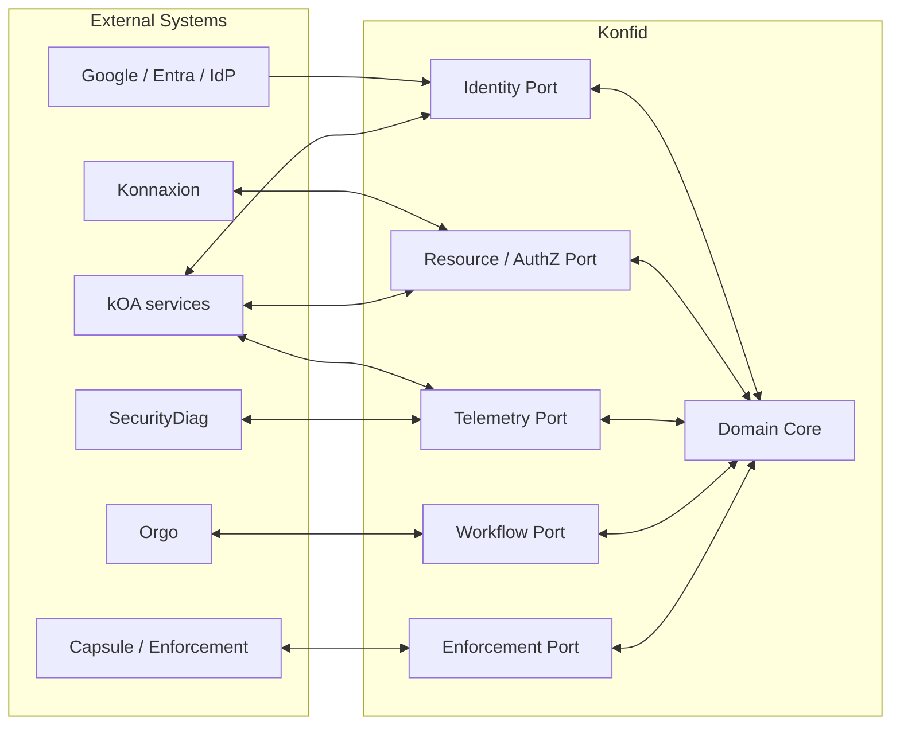

# 01 — Architecture

## 1. Vue d'ensemble

Konfid est conçu selon une architecture hexagonale : le domaine de sécurité ne dépend pas directement de Google, Orgo, Konnaxion, d'une base de données spécifique ou d'un transport particulier. Ces dépendances sont intégrées via des ports et adapters.



## 2. Les trois plans

### 2.1 Control Plane

État versionné de sécurité :

- principals et bindings;
- comptes et organisations;
- ressources et actions;
- rôles, grants, délégations;
- politiques et policy bundles;
- approbation policies;
- detector catalog et response mappings;
- configuration des intégrations.

### 2.2 Decision Plane

Chemin critique et faible latence :

- `EvaluateAccess`;
- `EvaluateRisk`;
- `EvaluateResponse`;
- `ValidateApproval`;
- `IssueCapability`;
- `RevokeCapability`.

Le Decision Plane DOIT pouvoir répondre sans attendre les pipelines analytiques lents.

### 2.3 Evidence Plane

Contient :

- audit receipts;
- security events;
- traces corrélées;
- décision/policy references;
- forensic evidence bornée;
- preuves de qualification de détecteur/policy.

La télémétrie brute volumineuse peut être stockée dans un système distinct du registre de preuve faisant autorité.

## 3. Modules du cœur

### Directory

Maintient les principals, bindings, comptes, aliases vérifiés, role mailboxes et relations d'organisation.

### Access

Maintient les grants, délégations, scopes, resource catalog, capabilities et obligations.

### Policy Adapter

Transforme le contexte canonique Konfid en requêtes vers kOA Governance Policy Runtime et vérifie la décision retournée.

### Overwatch

Normalise la télémétrie, construit des baselines, exécute des détecteurs, produit des `RiskSignal` versionnés.

### Response

Transforme un état de risque et le contexte en `ResponseProposal`, obtient les autorisations nécessaires et coordonne l'exécution.

### Approval

Gère la policy d'approbation, la validation de quorum, la séparation des acteurs et la validité temporelle des receipts provenant d'Orgo.

### Assurance

Qualifie les changements de policy et détecteurs, orchestre replay, shadow, canary et intégration SecurityDiag.

### Evidence

Produit les événements minimisés vers Audit Broker et gère les références vers les preuves restreintes.

## 4. Modular monolith, pas microservices par défaut

La version de référence utilise un modular monolith pour :

- réduire la complexité transactionnelle;
- simplifier les invariants;
- diminuer les surfaces réseau;
- rendre les décisions synchrones plus simples à raisonner;
- accélérer les migrations cohérentes.

Chaque module DOIT cependant :

- avoir une API interne explicite;
- ne pas lire directement les tables privées d'un autre module;
- publier des domain events versionnés;
- posséder ses migrations ou namespaces clairement identifiés;
- pouvoir être extrait sans changer le modèle canonique.

## 5. Bulkheads

Les ressources opérationnelles doivent être isolées :

- pool de workers Authorization;
- pool Response/Revocation prioritaire;
- pool ingestion Overwatch;
- pool analytics/baseline;
- pool evidence export;
- pool admin/reporting.

Un flood télémétrique ne doit jamais épuiser les ressources réservées à `DENY`, `REVOKE` ou `ISOLATE`.

## 6. Priorités de traitement

1. **P0 — sécurité immédiate** : revoke, deny propagation, isolate, credential invalidation.
2. **P1 — décisions d'autorisation**.
3. **P2 — security event ingestion**.
4. **P3 — analytics, baselines, reporting et replays**.

## 7. Défaillance et continuité

### Dépendance IdP indisponible

- Les sessions existantes peuvent continuer dans leurs limites locales.
- Les opérations exigeant une réauthentification ou un niveau d'assurance supérieur sont bloquées.
- Les comptes break-glass souverains restent disponibles selon leur policy.

### Orgo indisponible

- Les actions automatiques déjà permises peuvent continuer.
- Toute action nécessitant un quorum humain reste `BLOCKED_PENDING_APPROVAL`.
- Revoke/deny/isolate ne dépendent pas d'Orgo si leur policy autorise l'automatisation.

### Overwatch indisponible

- L'autorisation de base continue.
- Les signaux de risque frais deviennent `UNKNOWN`.
- Les politiques critiques peuvent choisir de bloquer certaines actions si `risk_freshness` est obligatoire.

### Audit Broker indisponible

- Les actions ordinaires peuvent être mises en file locale durable si la policy l'autorise.
- Une opération critique exigeant un receipt auditable DOIT échouer fermée.

### Governance Policy Runtime indisponible

- Les opérations critiques échouent fermées.
- Les capacités déjà signées et non expirées peuvent rester utilisables uniquement si elles ont été conçues explicitement pour une continuité bornée.

## 8. Propriété des données

Konfid ne devient jamais la base canonique des objets métier. Il stocke des **références de ressource** et leur classification de sécurité, pas la donnée métier elle-même.

Exemple :

```text
resource_ref = konnaxion://org/ABC/employee/5821
resource_class = HR.EMPLOYEE.RESTRICTED
data_owner = konnaxion
```

## 9. Trust boundaries

Les frontières principales sont :

- navigateur ↔ application;
- application ↔ Konfid;
- Konfid ↔ kOA policy/audit;
- Konfid ↔ Orgo;
- Konfid ↔ enforcement agent;
- tenant A ↔ tenant B;
- control plane ↔ evidence plane;
- operator humain ↔ privileged execution.

Chaque passage de frontière exige une identité authentifiée, un contrat versionné, un scope explicite et une corrélation traçable.
