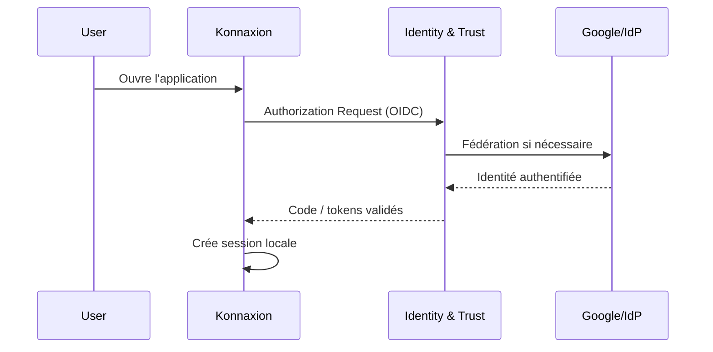

# 02 — Identité, authentification et SSO

## 1. Principe

Konfid ne réimplémente pas l'authentification humaine. Il consomme une preuve d'identité émise ou validée par **kOA Identity & Trust**, qui peut fédérer Google, Microsoft Entra ID, un fournisseur souverain ou un autre IdP approuvé.

## 2. Modèle d'identité

```text
Principal
 ├── IdentityBinding[]
 ├── AccountBinding[]
 ├── ContactEndpoint[]
 ├── RoleAssignment[]
 ├── RoleMailboxAssignment[]
 └── Delegation[]
```

### Principal

Identité canonique Konfid : personne, workload ou agent autorisé.

### IdentityBinding

Lien entre un principal et une identité authentifiée externe.

Clé de fédération recommandée :

```text
provider_type + issuer + subject
```

Pour OIDC, `issuer + sub` est l'identifiant externe canonique.

### AccountBinding

Lien entre le principal et le compte local d'une application :

```text
system = konnaxion
account_id = K-882
principal_id = P123
```

### ContactEndpoint

Email, téléphone ou endpoint de notification vérifié. Un contact n'est pas une identité canonique.

### RoleMailboxAssignment

Représente qui contrôle une adresse fonctionnelle et pendant quelle période :

```text
mailbox = direction@abc.ca
principal = P123
role = DIRECTOR
valid_from = ...
valid_until = ...
```

## 3. Interdiction du linking silencieux par email

Konfid NE DOIT PAS fusionner deux principals parce que :

- leurs emails sont identiques;
- leur nom d'affichage est identique;
- leur domaine email est identique;
- un email ancien est réattribué.

Tout linking à haut impact doit être :

- fondé sur une identité authentifiée stable;
- explicitement approuvé ou attesté selon policy;
- audité;
- réversible par procédure gouvernée.

## 4. Flux SSO Konnaxion



Konnaxion conserve sa session applicative. Il ne transmet pas son cookie à Orgo ou Konfid.

## 5. Flux SSO Orgo

Orgo répète son propre flux OIDC. Si l'IdP possède déjà une session, l'expérience peut sembler « un clic » sans partage de cookie inter-application.

## 6. Flux Konfid UI

Le dashboard Konfid utilise la même autorité d'identité mais crée une session Konfid distincte. La possession d'une session Konfid ne confère aucune permission implicite.

## 7. Service-to-service authentication

Une requête interservice contient au minimum deux identités conceptuellement distinctes :

```text
caller_service = svc:konnaxion-prod
actor_principal = P123
```

- `caller_service` prouve quel workload appelle Konfid.
- `actor_principal` indique au nom de qui l'action est demandée.

L'identité du service DOIT être authentifiée par une workload identity, certificat, signature ou credential court terme. Un token Google utilisateur NE DOIT PAS servir de credential interservice générique.

## 8. Session vs autorité

Une session locale prouve seulement qu'un utilisateur est authentifié auprès de l'application. Pour toute action sensible, l'application doit obtenir ou vérifier une décision d'autorisation fraîche.

```text
Session valide != droit permanent
```

## 9. Step-up authentication

Une policy peut exiger :

- authentification plus récente;
- méthode résistante au phishing;
- second facteur;
- device trust;
- présence d'un humain;
- combinaison de plusieurs facteurs.

Une réponse typique :

```json
{
  "decision": "STEP_UP_REQUIRED",
  "required_assurance": "phishing_resistant",
  "max_auth_age_seconds": 300
}
```

Après step-up, l'application soumet une nouvelle évaluation.

## 10. Multi-IdP

Google peut être le fournisseur privilégié pour l'UX, mais Konfid DOIT rester multi-IdP. Au minimum, l'architecture doit pouvoir intégrer :

- Google;
- Microsoft Entra ID;
- IdP souverain/local;
- identité d'urgence hors fournisseur externe.

## 11. Break-glass identity

Les identités d'urgence :

- ne dépendent pas d'un IdP SaaS unique;
- utilisent des credentials matériels ou équivalents fortement protégés;
- sont très peu nombreuses;
- sont désactivées ou scellées hors usage normal lorsque possible;
- déclenchent un audit renforcé;
- ne contournent pas automatiquement les règles de quorum;
- possèdent une portée et une durée limitées.

## 12. Révocation

Konfid peut révoquer :

- une IdentityBinding;
- une capability;
- une délégation;
- un grant;
- un compte applicatif via adaptateur;
- une session via notification à l'application propriétaire.

La révocation de session inter-applications est une commande explicite et auditable; elle n'implique pas nécessairement suppression du compte.
