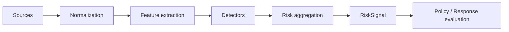

# 04 — Overwatch et moteur de risque

## 1. Mission

Overwatch observe les événements de sécurité, construit des signaux de risque et détecte les comportements inhabituels. Il **n'autorise pas** une action et **n'exécute pas** de réponse privilégiée.

Sa sortie est un `RiskSignal`, jamais un ordre direct de shutdown.

## 2. Pipeline



## 3. Sources

Sources possibles :

- décisions d'accès;
- authentifications importantes;
- changements de permission;
- accès à des données sensibles;
- exports;
- actions privilégiées;
- erreurs répétées;
- revocations;
- événements endpoint/service;
- signaux Capsule/host;
- événements applicatifs explicitement déclarés.

Konfid ne doit pas collecter « tout » par défaut.

## 4. Profils d'observabilité

### ESSENTIAL

Toujours actif pour les événements de sécurité minimaux :

- acteur;
- service;
- action;
- classe de ressource;
- résultat;
- policy/decision ref;
- timestamp;
- corrélation;
- version logicielle.

### SECURITY

Ajoute les métadonnées utiles à la détection : fréquence, volume, patterns, erreurs, caractéristiques agrégées.

### FORENSIC

Capture temporairement enrichie, uniquement avec :

- scope précis;
- motif;
- autorité valide;
- durée/expiration;
- classification;
- accès restreint;
- audit renforcé.

## 5. Minimisation

Overwatch privilégie les **métadonnées de sécurité** plutôt que le contenu. Par exemple :

```json
{
  "actor": "P123",
  "operation": "employee.read",
  "resource_class": "HR.EMPLOYEE.MEDICAL",
  "count": 420,
  "window_seconds": 120,
  "decision": "ALLOW"
}
```

plutôt que le contenu des 420 dossiers.

## 6. Détecteurs

Types de détecteurs possibles :

- règles déterministes;
- seuils adaptatifs;
- modèles comportementaux;
- corrélation multi-sources;
- détection de séquence;
- réputation de service/appareil;
- intégrité de configuration.

Chaque détecteur DOIT avoir :

```text
detector_id
version
owner
input_schema
output_schema
training_or_rule_provenance
confidence_semantics
known_limitations
activation_state
rollout_state
```

## 7. RiskSignal

Exemple :

```json
{
  "risk_signal_id": "RS-9921",
  "principal": "P123",
  "target": "tenant:ABC",
  "severity": "critical",
  "score": 92,
  "confidence": 0.96,
  "detector_id": "bulk-sensitive-read",
  "detector_version": "17",
  "reasons": [
    "420 sensitive records in 120 seconds",
    "18x baseline",
    "export attempted after read burst"
  ],
  "observed_at": "...",
  "expires_at": "..."
}
```

Le score n'est jamais à lui seul une autorisation.

## 8. Agrégation de risque

Konfid peut combiner plusieurs signaux, mais la combinaison doit être versionnée et explicable. Les policies doivent pouvoir distinguer :

- risque inconnu;
- risque faible;
- risque élevé;
- preuve déterministe de compromission.

## 9. Anti-poisoning

Les baselines et modèles ne doivent pas être modifiés directement par les données de production sans garde-fous. Les mesures comprennent :

- fenêtres d'apprentissage contrôlées;
- exclusion des incidents connus;
- provenance des features;
- validation hors ligne;
- détection de drift;
- shadow mode;
- rollback immédiat.

## 10. Faux positifs

Cycle normatif :

```text
incident
 -> classification
 -> candidate detector change
 -> historical replay
 -> false-positive / false-negative analysis
 -> shadow mode
 -> SecurityDiag qualification
 -> approval
 -> signed version
 -> canary rollout
 -> production
```

Une classification `FALSE_POSITIVE` NE DOIT PAS désactiver automatiquement une règle ni réduire une permission.

## 11. Déploiement Canary

Les détecteurs supportent :

- disabled;
- shadow;
- 1%;
- 10%;
- 50%;
- 100%;
- rollback.

Pour les détecteurs critiques, la comparaison avec la version précédente doit être observable pendant le rollout.

## 12. Bulkhead et overload

Overwatch doit supporter :

- backpressure;
- admission control;
- sampling non critique;
- file durable;
- DLQ;
- dégradation contrôlée.

Il NE DOIT PAS consommer les ressources réservées au chemin d'autorisation ou aux révocations P0.

## 13. Conservation

La rétention dépend de la classe de donnée et du besoin de sécurité. Les features et agrégats peuvent avoir une rétention différente des preuves d'audit.

Les données forensiques ont une durée bornée et une procédure de purge vérifiable.
