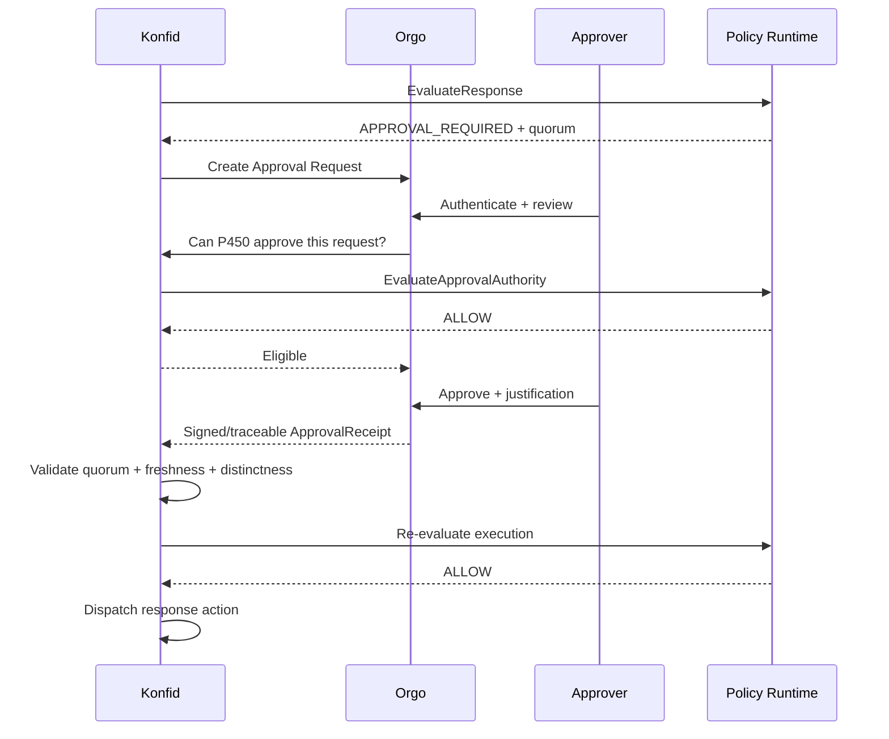

# 06 — Approbations, séparation des pouvoirs et break-glass

## 1. Principe

Orgo orchestre l'expérience humaine, mais **Konfid reste l'autorité qui valide si un ensemble d'approbations satisfait la policy de sécurité**.

Une case Orgo « approved=true » n'est jamais suffisante à elle seule.

## 2. ApprovalPolicy

Une policy peut contenir :

```text
operation
minimum_authority
threshold
eligible_roles[]
distinct_humans
requester_may_approve
operator_may_approve
same_manager_chain_allowed
required_assurance
max_auth_age
approval_ttl
justification_required
scope_constraints
emergency_variant
```

Exemple :

```text
operation = FREEZE_TENANT
threshold = 2-of-3
distinct_humans = true
requester_may_approve = false
operator_may_approve = false
required_assurance = phishing_resistant
max_auth_age = 300s
approval_ttl = 15m
```

## 3. Acteurs distincts

Les rôles conceptuels sont :

- demandeur;
- approbateur;
- opérateur;
- observateur/auditeur;
- autorité de closure.

Selon la criticité, plusieurs rôles peuvent être tenus par la même personne, mais la policy doit le déclarer. Pour les opérations extrêmes, séparation stricte.

## 4. Flux d'approbation



## 5. ApprovalReceipt

Minimum :

```text
approval_id
request_id
approver_principal
decision
justification_ref or bounded text
auth_assurance
auth_time
approved_at
scope
policy_version
orgo_case_ref
signature_or_integrity_ref
```

## 6. Fraîcheur

Les approbations expirent. Konfid réévalue juste avant exécution :

- approbateur toujours actif ?
- rôle encore valide ?
- grant révoqué ?
- auth trop ancienne ?
- scope identique ?
- request modifiée ?
- quorum toujours satisfait ?

Toute modification significative de la demande invalide les approbations précédentes sauf policy contraire explicite.

## 7. Auto-approbation

Par défaut :

```text
requester_may_approve = false
```

Un administrateur global ne bénéficie pas d'une exception implicite.

## 8. Break-glass

Le break-glass est une **procédure gouvernée d'exception**, pas un compte root permanent.

Il doit définir :

- trigger admissible;
- identité d'urgence;
- scope précis;
- actions permises;
- durée;
- compensating controls;
- audit renforcé;
- notification;
- révocation/closure;
- revue obligatoire.

## 9. Modes d'urgence

### Emergency access

Permet un accès temporaire à une ressource ou capability normalement inaccessible.

### Emergency containment

Permet une restriction rapide lorsqu'un délai d'approbation créerait un risque supérieur.

### Emergency recovery

Permet de restaurer un système isolé ou un service de sécurité selon procédures pré-approuvées.

Chaque mode a une policy distincte.

## 10. Indépendance des fournisseurs externes

Au moins un chemin de break-glass critique doit fonctionner sans Google, Entra ou Orgo SaaS. Cela ne signifie pas contourner Konfid; cela signifie posséder des credentials souverains, un stockage de policy local et un chemin d'audit robuste.

## 11. Orgo compromis

Si Orgo est compromis, l'attaquant ne doit pas pouvoir produire seul une action critique. Les mitigations comprennent :

- vérification de l'identité de l'approbateur par Konfid;
- validation indépendante de son autorité;
- policy version immuable;
- request digest;
- quorum;
- réévaluation finale;
- receipts intègres.

## 12. Notifications

Les notifications ne sont pas des autorisations. Email/SMS peut informer un approbateur, mais l'approbation doit être effectuée dans un canal authentifié supportant les exigences d'assurance de la policy.
